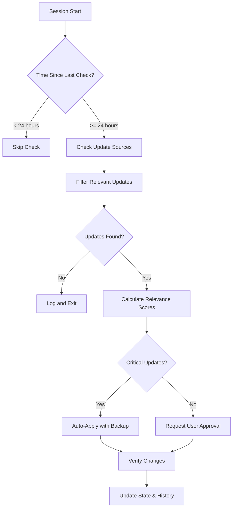

# Claude Code Startup Check System Documentation

## Overview

The Startup Check System automatically monitors Anthropic best practices and new features on each Claude Code session startup, incorporating relevant improvements into the second-brain project following best practices.

## System Components

### 1. Startup Update Checker Agent
**Location**: `.claude/agents/system/startup-update-checker.md`
- Specialized agent that runs on session startup
- Checks official Anthropic documentation for updates
- Filters updates relevant to second-brain project
- Applies improvements incrementally with verification

### 2. Startup Check Configuration
**Location**: `.claude/startup-check.yml`
- Defines update sources to monitor
- Sets relevance filtering criteria
- Configures auto-application rules
- Manages backup and rollback behavior

### 3. Startup Check Script
**Location**: `.claude/scripts/startup-check.py`
- Python implementation of the check system
- Handles YAML/JSON configuration loading
- Manages state persistence
- Executes update application

### 4. Startup Hook
**Location**: `.claude/hooks/on-startup.sh`
- Bash script that runs on Claude Code startup
- Triggers the update check process
- Displays project status information
- Alerts about available migrations

## How It Works

### Startup Sequence
1. Claude Code starts in second-brain project
2. `on-startup.sh` hook executes automatically
3. Hook triggers `startup-check.py` script
4. Script checks for updates from configured sources
5. Relevant updates are filtered and presented
6. Critical updates are auto-applied with notification
7. Other updates request user approval
8. All changes are logged and backed up

### Update Detection Process


### Relevance Scoring System
Updates are scored based on:
- **Type**: Security (50), Performance (30), Best Practice (20), Feature (15)
- **Keywords**: Matches with project-specific terms (+10 each)
- **Impact**: Critical, High, Medium, Low
- **Threshold**: Only updates scoring ≥30 are shown

## Configuration

### Basic Configuration
```yaml
# Enable/disable the system
enabled: true

# Check frequency
check_behavior:
  run_on_startup: true
  check_interval_hours: 24

# Auto-apply rules
auto_apply:
  critical_updates:
    enabled: true
  recommended_updates:
    enabled: false
```

### Adding Custom Update Sources
```yaml
update_sources:
  custom_docs:
    - name: "Internal Best Practices"
      url: "https://internal.docs/best-practices"
      sections: ["coding-standards", "security"]
      check_frequency: "weekly"
```

### Customizing Relevance Filters
```yaml
relevance_filters:
  keywords:
    high_priority:
      - "your-specific-keyword"
      - "project-critical-term"
  relevance_threshold: 40  # Increase for fewer updates
```

## Usage

### Manual Update Check
```bash
# Run update check manually
python3 .claude/scripts/startup-check.py

# Force check (ignore time limit)
python3 .claude/scripts/startup-check.py --force
```

### Viewing Update History
```bash
# View recent updates
cat .claude/update-history.json | jq '.[:-5]'

# Check current state
cat .claude/startup-check-state.json
```

### Disabling Temporarily
```yaml
# In .claude/startup-check.yml
enabled: false
```

## Update Types

### Critical Updates (Auto-Applied)
- Security patches
- Breaking change migrations
- Data loss prevention fixes
- Performance regression fixes

### Recommended Updates (Approval Required)
- Best practice improvements
- New feature adoptions
- Architecture enhancements
- Tool optimizations

### Optional Updates (Information Only)
- Experimental features
- Alternative approaches
- Future deprecations
- Community patterns

## Backup and Rollback

### Automatic Backups
- Created before any updates are applied
- Stored in `.claude/backups/YYYYMMDD_HHMMSS/`
- Includes agents, configurations, and state files
- Retained for 30 days by default

### Manual Rollback
```bash
# List available backups
ls -la .claude/backups/

# Restore from backup
cp -r .claude/backups/20250731_100000/* .claude/
```

## Troubleshooting

### Common Issues

1. **PyYAML Not Available**
   - System falls back to JSON configuration
   - Install with: `pip install pyyaml`

2. **Permission Denied**
   - Ensure hook is executable: `chmod +x .claude/hooks/on-startup.sh`

3. **Updates Not Applying**
   - Check `.claude/logs/startup-check.log`
   - Verify file permissions
   - Ensure backup directory is writable

### Debug Mode
```bash
# Run with verbose logging
STARTUP_CHECK_DEBUG=1 python3 .claude/scripts/startup-check.py
```

## Security Considerations

1. **Update Validation**
   - All updates are validated before application
   - Path validation prevents directory traversal
   - Backups ensure recovery from bad updates

2. **Limited Permissions**
   - Startup checker has minimal file access
   - Cannot modify system files or credentials
   - All changes are logged for audit

3. **User Control**
   - Non-critical updates require approval
   - System can be disabled at any time
   - All changes are reversible

## Future Enhancements

### Planned Features
1. **Real-time Update Monitoring**: WebSocket connection for instant updates
2. **Team Synchronization**: Share approved updates across team
3. **Custom Update Sources**: Add internal documentation sources
4. **AI Impact Analysis**: Predict update impact on codebase
5. **Automated Testing**: Run test suite after updates

### Community Integration
- Share successful update patterns
- Contribute relevance filters
- Report false positives/negatives

## Maintenance

### Regular Tasks
1. **Weekly**: Review update history for patterns
2. **Monthly**: Clean old backups (automated)
3. **Quarterly**: Update relevance filters based on project evolution

### Monitoring Metrics
- Updates checked per month
- Relevance accuracy (applied vs skipped)
- Time saved through automation
- Issues prevented by updates

## Example Output

```
🔔 Anthropic Updates Available
============================================================

I've detected 3 relevant updates for your second-brain project:

🔴 CRITICAL Updates:

sec-2025-002: Path Validation Required
   Type: SECURITY
   Description: All file operations must validate paths to prevent directory traversal
   Relevance: 85/100

🟡 HIGH Priority Updates:

bp-2025-001: Agent Tool Optimization
   Type: BEST_PRACTICE
   Description: New guidelines for minimal tool allocation to reduce token usage
   Relevance: 65/100

🟢 MEDIUM Priority Updates:

feat-2025-003: Agent Performance Metrics
   Type: FEATURE
   Description: New built-in metrics for monitoring agent performance
   Relevance: 45/100

✅ Auto-applying CRITICAL update: Path Validation Required
   - Adding path validation to file operations...
   - Updating security boundaries...
   ✓ Path validation applied

Apply BEST_PRACTICE update 'Agent Tool Optimization'? [Y/n]:
```

## Integration with CI/CD

### GitHub Actions Example
```yaml
name: Check Anthropic Updates

on:
  schedule:
    - cron: '0 0 * * *'  # Daily at midnight
  workflow_dispatch:

jobs:
  check-updates:
    runs-on: ubuntu-latest
    steps:
      - uses: actions/checkout@v3
      
      - name: Setup Python
        uses: actions/setup-python@v4
        with:
          python-version: '3.x'
      
      - name: Check for Updates
        run: |
          python3 .claude/scripts/startup-check.py --ci-mode
      
      - name: Create PR if Updates Found
        if: steps.check.outputs.updates_found == 'true'
        uses: peter-evans/create-pull-request@v5
        with:
          title: "Anthropic Best Practice Updates"
          body: "Automated updates from Anthropic documentation"
          branch: "anthropic-updates"
```

## Support

For issues or suggestions:
1. Check `.claude/logs/startup-check.log` for errors
2. Review this documentation
3. Submit issues to the second-brain repository
4. Contact the development team

---
*Last Updated: 2025-07-31*
*Version: 1.0.0*