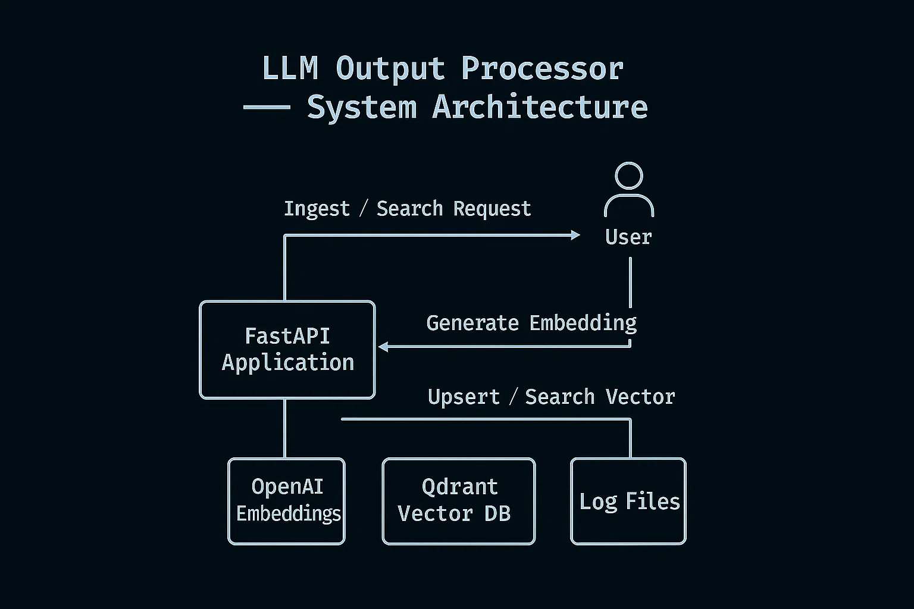

[](https://github.com/raold/second-brain/actions/workflows/ci.yaml)

# LLM Output Processor

> Ingest, Embed, and Search Text Semantically using OpenAI Embeddings + Qdrant Vector DB.


## 📦 Project Overview
This API enables ingestion of text data, which is embedded via OpenAI's `text-embedding-3-small` model and stored in Qdrant for semantic search.


## 🚀 Features
- Token-based auth
- Production-grade logging with rotation
- Retry and backoff for OpenAI API
- Dimension validation for embeddings
- Automated test suite (pytest)
- Makefile for dev workflow


## ⚙️ Requirements
- Docker + Docker Compose
- OpenAI API Key
- Python 3.10+ (for local dev)


## 📁 Project Structure




```
second-brain/
├── app/
│   ├── main.py
│   ├── router.py
│   ├── auth.py
│   ├── config.py
│   ├── qdrant_client.py
│   └── utils/
│       ├── logger.py
│       └── openai_client.py
├── tests/
│   ├── __init__.py
│   ├── test_health.py
│   ├── test_ingest.py
│   └── test_search.py
├── docs/
│   ├── USAGE.md
│   ├── ARCHITECTURE.md
│   └── CHANGE_AUDIT.md
├── logs/               # Log files (gitignored)
├── qdrant_data/        # Persistent data for Qdrant (gitignored)
├── docker-compose.yml
├── Makefile
├── requirements.txt
├── .gitignore
├── LICENSE
└── README.md
```


## 🔧 Setup

1. Clone the repo:
```bash
git clone <repo-url>
cd llm_output_processor
```

2. Create a `.env` file:
```
OPENAI_API_KEY=your_openai_key
API_TOKENS=your_token
OPENAI_EMBEDDING_MODEL=text-embedding-3-small
LOG_PATH=logs/processor.log
LOG_LEVEL=INFO
```

3. Build and run:
```bash
make build
make up
```

## 🏁 Getting Started

See the [full Deployment Instructions](./docs/DEPLOYMENT.md) for detailed setup and configuration steps.


API Docs:  
[http://localhost:8000/docs](http://localhost:8000/docs)

Qdrant Dashboard:  
[http://localhost:6333/dashboard](http://localhost:6333/dashboard)


## ✅ API Endpoints

- `GET /health` - Health check
- `POST /ingest` - Ingest a text payload
- `GET /search?q=text` - Search semantically


## 🧪 Testing
```bash
make test
```

## 🧹 Formatting
```bash
make lint
```


## 🛡️ License
AGPLv3 — Free for use with source-sharing required for derivatives.


## 🛠️ Roadmap
- API Rate Limiting
- Metrics / Monitoring
- Dynamic collection versioning
