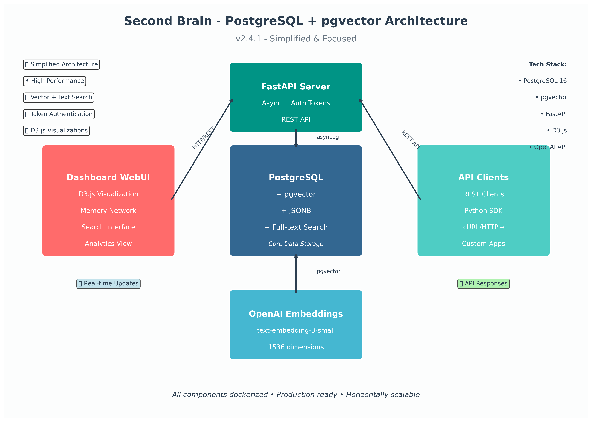

[](https://github.com/raold/second-brain/actions/workflows/ci.yaml)
[](https://github.com/raold/second-brain/actions/workflows/deploy.yml)

# LLM Output Processor

> Ingest, Embed, and Search Text Semantically using OpenAI Embeddings + Qdrant Vector DB.

## 📦 Project Overview
This API enables ingestion of text data, which is embedded via OpenAI's `text-embedding-3-small` model and stored in Qdrant for semantic search.

## 🚀 Features
- **Token-based authentication** with environment-specific tokens
- **Production-grade logging** with rotation and environment-specific levels
- **Retry and backoff** for OpenAI API with tenacity
- **Dimension validation** for embeddings
- **Automated test suite** (pytest) with comprehensive coverage
- **Makefile** for streamlined development workflow
- **CI/CD Pipeline** with 50-70% faster builds through intelligent caching
- **Multi-environment deployment** (staging → production)
- **Docker layer caching** for 60-80% faster builds
- **Environment-specific configurations** with secure secret management

## ⚙️ Requirements
- Docker + Docker Compose
- OpenAI API Key
- Python 3.11+ (for local dev)
- GitHub repository (for CI/CD features)

## 📁 Project Structure


```
second-brain/
├── app/
│   ├── __init__.py
│   ├── main.py              # FastAPI application entry point
│   ├── router.py            # API endpoints and routing
│   ├── auth.py              # Authentication middleware
│   ├── config.py            # Configuration management
│   ├── models.py            # Pydantic data models
│   ├── handlers.py          # Business logic handlers
│   ├── utils/
│   │   ├── __init__.py
│   │   ├── logger.py        # Logging configuration
│   │   └── openai_client.py # OpenAI API client
│   ├── storage/
│   │   ├── qdrant_client.py # Qdrant vector database client
│   │   ├── markdown_writer.py # Markdown file operations
│   │   └── shell_runner.py  # Shell command execution
│   └── data/
│       ├── memories/        # Stored memory files
│       └── tasks.md         # Task management
├── tests/
│   ├── __init__.py
│   ├── test_health.py       # Health endpoint tests
│   ├── test_ingest.py       # Ingestion endpoint tests
│   ├── test_search.py       # Search endpoint tests
│   └── test_payload.json    # Test data
├── docs/
│   ├── ARCHITECTURE.md      # System architecture documentation
│   ├── DEPLOYMENT.md        # Deployment instructions
│   ├── USAGE.md             # Usage examples
│   ├── CI_CACHING.md        # CI/CD caching strategy
│   ├── ENVIRONMENT_VARIABLES.md # Environment configuration
│   ├── CONTRIBUTING.md      # Contribution guidelines
│   ├── architecture.puml    # PlantUML architecture diagram
│   └── system_architecture.png # Architecture visualization
├── .github/
│   └── workflows/
│       ├── ci.yaml          # CI pipeline with caching
│       └── deploy.yml       # Deployment automation
├── logs/                    # Log files (gitignored)
├── qdrant_data/             # Development Qdrant data (gitignored)
├── qdrant_data_staging/     # Staging Qdrant data (gitignored)
├── qdrant_data_production/  # Production Qdrant data (gitignored)
├── docker-compose.yml       # Development environment
├── docker-compose.staging.yml    # Staging environment
├── docker-compose.production.yml # Production environment
├── Dockerfile               # Optimized Docker image
├── requirements.txt         # Python dependencies
├── Makefile                 # Development commands
├── ruff.toml               # Linting configuration
├── pytest.ini             # Test configuration
├── .env.example           # Environment variables template
├── .gitignore             # Git ignore rules
├── CHANGELOG.md           # Release history
├── SECURITY.md            # Security policy
├── LICENSE                # AGPLv3 license
└── README.md              # This file
```

## 🔧 Setup

### Local Development

1. Clone the repo:
```bash
git clone <repo-url>
cd second-brain
```

2. Create a `.env` file:
```bash
cp .env.example .env
# Edit .env with your configuration
```

3. Build and run:
```bash
make build
make up
```

### Production Deployment

1. **Set up GitHub Secrets**:
   - `OPENAI_API_KEY`: Your OpenAI API key
   - `DOCKER_REGISTRY`: Your Docker registry (e.g., `ghcr.io/username`)
   - `STAGING_API_TOKENS`: Staging environment tokens
   - `PRODUCTION_API_TOKENS`: Production environment tokens

2. **Create GitHub Environments**:
   - Go to Settings → Environments
   - Create "staging" and "production" environments
   - Configure protection rules as needed

3. **Deploy automatically**:
   - Push to `main` branch triggers CI
   - Successful CI automatically deploys to staging
   - Manual approval deploys to production

## 🏁 Getting Started

See the [full Deployment Instructions](./docs/DEPLOYMENT.md) for detailed setup and configuration steps.

### Local Development URLs
- **API Docs**: [http://localhost:8000/docs](http://localhost:8000/docs)
- **Qdrant Dashboard**: [http://localhost:6333/dashboard](http://localhost:6333/dashboard)

### Staging Environment URLs
- **API Docs**: [http://localhost:8001/docs](http://localhost:8001/docs)
- **Qdrant Dashboard**: [http://localhost:6334/dashboard](http://localhost:6334/dashboard)

## ✅ API Endpoints

- `GET /health` - Health check
- `POST /ingest` - Ingest a text payload
- `GET /search?q=text` - Search semantically

## 🧪 Testing
```bash
make test
```

## 🧹 Formatting
```bash
make lint
```

## 🚀 CI/CD Features

### Performance Optimizations
- **50-70% faster CI builds** through intelligent caching
- **Docker layer caching** for 60-80% faster builds
- **Parallel job execution** (setup, docker-build, lint, test)
- **Smart cache invalidation** based on file changes

### Deployment Automation
- **Automatic deployment** after successful CI
- **Multi-environment support** (staging → production)
- **Health checks** and rollback capabilities
- **Environment protection** with approval gates

### Environment Management
- **Environment-specific configurations** with separate Docker Compose files
- **GitHub Secrets integration** for secure credential management
- **Resource limits** and production optimizations
- **Comprehensive documentation** and setup guides

## 📚 Documentation

- [**CI Caching Strategy**](./docs/CI_CACHING.md) - Performance optimization guide
- [**Environment Variables**](./docs/ENVIRONMENT_VARIABLES.md) - Configuration management
- [**Deployment Guide**](./docs/DEPLOYMENT.md) - Production deployment instructions
- [**Architecture Overview**](./docs/ARCHITECTURE.md) - System design documentation
- [**Usage Examples**](./docs/USAGE.md) - API usage patterns
- [**Contributing Guidelines**](./docs/CONTRIBUTING.md) - How to contribute

## 📋 Resources

### 📖 Documentation
- [**Architecture Overview**](./docs/ARCHITECTURE.md) - System design and architecture
- [**Deployment Guide**](./docs/DEPLOYMENT.md) - Production deployment instructions
- [**Usage Examples**](./docs/USAGE.md) - API usage patterns and examples
- [**CI Caching Strategy**](./docs/CI_CACHING.md) - Performance optimization guide
- [**Environment Variables**](./docs/ENVIRONMENT_VARIABLES.md) - Configuration management

### 🛠️ Development
- [**Contributing Guidelines**](./docs/CONTRIBUTING.md) - How to contribute to the project
- [**Makefile**](./Makefile) - Development commands and shortcuts
- [**Requirements**](./requirements.txt) - Python dependencies
- [**Docker Configuration**](./Dockerfile) - Container setup

### 🔒 Security & Legal
- [**Security Policy**](./SECURITY.md) - Security vulnerabilities and reporting
- [**License**](./LICENSE) - AGPLv3 license terms
- [**Changelog**](./CHANGELOG.md) - Release history and changes

### 🚀 CI/CD & Deployment
- [**CI Pipeline**](./.github/workflows/ci.yaml) - Continuous integration workflow
- [**Deployment Pipeline**](./.github/workflows/deploy.yml) - Automated deployment workflow
- [**Development Environment**](./docker-compose.yml) - Local development setup
- [**Staging Environment**](./docker-compose.staging.yml) - Staging deployment configuration
- [**Production Environment**](./docker-compose.production.yml) - Production deployment configuration

### 📊 Monitoring & Health
- **API Health Check**: `GET /health` - Service health status
- **Qdrant Dashboard**: [http://localhost:6333/dashboard](http://localhost:6333/dashboard) - Vector database management
- **API Documentation**: [http://localhost:8000/docs](http://localhost:8000/docs) - Interactive API docs

## 🛡️ License
AGPLv3 — Free for use with source-sharing required for derivatives.

## 🛠️ Roadmap
- **v1.3.0**: Full test mocking, metrics/monitoring, API rate limiting
- **v1.4.0**: Blue-green deployment, database migration automation
- **v1.5.0**: Advanced caching strategies, performance monitoring

## 🔒 Security Vulnerabilities

Please report any security vulnerabilities **privately** via [security@oldham.io](mailto:security@oldham.io).  
Do **not** open public issues for security concerns — see [SECURITY.md](./SECURITY.md) for full details.
