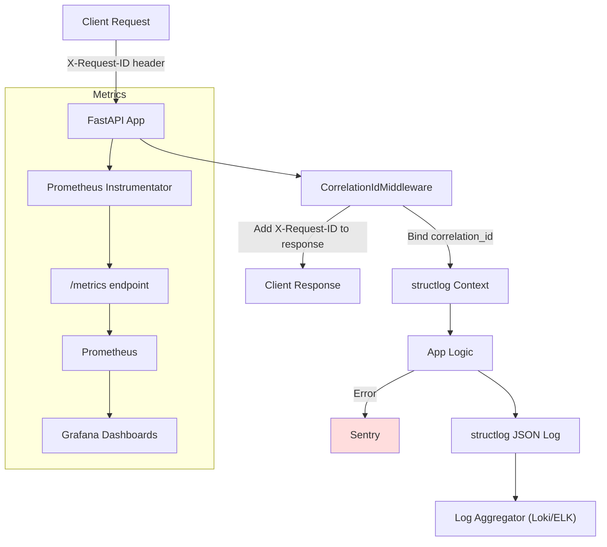

# LLM Output Processor - Architecture Overview

## System Diagram
```
[Client] --> [FastAPI App] --> [OpenAI Embeddings API]
                      |
                      v
                 [Qdrant Vector DB]
                      |
                      v
                 [Postgres DB]
                      |
                      v
                 [Plugins/Integrations]
```

## Voice Assistant Pipeline (Mobile, Electron, PWA)

This diagram illustrates the end-to-end flow for voice input, transcription, LLM processing, TTS output, intent detection, memory persistence, feedback, replay, and plugins:

```mermaid
flowchart TD
    subgraph "🏕️ Full Pipeline — Mobile, Electron, PWA Voice Assistant"
        A1["🎙️ 1. Input: Mobile, Electron, PWA"]
        A2["Mobile/PWA:<br/>• Mic recording (MediaRecorder API)<br/>• Send audio blob to backend"]
        A3["Electron:<br/>• Mic recording (getUserMedia)<br/>• Send audio buffer to backend"]
        B["🧠 2. Processing: Backend<br/>API Endpoint: /transcribe<br/>• Accepts audio blob<br/>• Calls OpenAI Whisper API<br/>• Returns transcript"]
        C1["POST /ingest<br/>Save, embed, classify intent, persist to Qdrant & Postgres"]
        C2["WS /generate<br/>Stream LLM response"]
        D["🔊 3. Output: ElevenLabs TTS<br/>• Stream tokens from /ws/generate<br/>• Batch & send to ElevenLabs TTS API<br/>• Playback audio stream"]
        E["📝 4. Feedback/Correction<br/>• Edit/Delete/Correct/Upvote via API/UI<br/>• Update Postgres/Qdrant"]
        F["🔁 5. Replay/Summarize<br/>• Aggregate related memories<br/>• Summarize via LLM"]
        G["🔌 6. Plugins/Integrations<br/>• Reminders, webhooks, file/PDF search, etc."]
    end

    %% Input
    A1 --> A2
    A1 --> A3
    A2 --> B
    A3 --> B

    %% Processing
    B -->|Transcript| C1
    B -->|Transcript| C2

    %% Output
    C2 --> D
    C1 --> E
    E --> F
    F --> G

    %% System Components Table (as a comment for reference)
    %% Component         Role
    %% Mobile/PWA        Record mic input → send to /transcribe
    %% Electron App      Same as above for desktop
    %% /transcribe       New API endpoint → OpenAI Whisper API
    %% /ingest           Store + embed + classify intent + persist
    %% /ws/generate      Get real-time LLM responses
    %% TTS Handler       Batches tokens → ElevenLabs API → audio playback
    %% Feedback API      Edit/delete/correct/upvote memories
    %% Replay/Summarize  Aggregate/summarize memories
    %% Plugins           Reminders, webhooks, file/PDF search, etc.
```



**Explanation:**
- **Input:** Users speak into a mobile app/PWA or Electron desktop app, which records audio and sends it to the backend.
- **Processing:** The `/transcribe` endpoint uses Whisper (local or OpenAI) to convert speech to text. The transcript is then ingested and embedded, and can be used to generate LLM responses in real time.
- **Output:** LLM responses are streamed, batched, and sent to ElevenLabs TTS for audio playback to the user.
- **System Components:** See the table in the diagram comments for a breakdown of each component and its role.

## Components

### 1. FastAPI Application
- Exposes REST endpoints:
  - `/health`
  - `/ingest`
  - `/search`
- Applies token-based authorization.

### 2. OpenAI Embedding Client
- Uses `text-embedding-3-small` via OpenAI API.
- Embeddings generated with retry + backoff logic.

### 3. Qdrant Vector Database
- Stores and indexes embeddings.
- Configured for 1536-dimension vectors using Cosine distance.

### 4. Postgres Memory Persistence
- Stores all memories, metadata, intent, feedback, and version history.
- Enables advanced SQL querying, replay, and personalized ranking.

### 5. Plugin System
- Extensible plugins for reminders, webhooks, file/PDF search, and more.
- Plugins can trigger actions, notifications, and integrations.

### 6. Feedback & Correction Loop
- API/UI endpoints for edit, delete, correct intent, and upvote.
- Feedback tracked in Postgres for personalized ranking.

### 7. Replay & Summarization
- Aggregate and summarize related memories for recall workflows.
- LLM-powered summarization endpoint.

## Data Flow

1. **Ingest**
   - Input text/audio → OpenAI Embedding + Whisper → Intent detection → Stored in Qdrant & Postgres.

2. **Search**
   - Query text → OpenAI Embedding → Similar vectors retrieved from Qdrant → Metadata/intent/feedback from Postgres.

3. **Replay/Summarize**
   - Aggregate related memories from Postgres → Summarize via LLM.

4. **Feedback/Correction**
   - User edits/deletes/corrects/upvotes memory → Updates Qdrant & Postgres.

5. **Plugins/Integrations**
   - Trigger plugin actions (reminders, webhooks, file search, etc).

## Configuration

All settings centralized in `config.py` and `.env`:
- API keys
- Model names
- Qdrant host/port
- Retry configurations
- Logging levels and paths

### Logging & Monitoring Architecture



*For editing or viewing the diagram source, see [`docs/logging_monitoring_architecture.mmd`](./logging_monitoring_architecture.mmd).* 

## Testing

- Unit and integration tests available via:
```bash
make test
```
- Tests validate ingestion, search, and health checks.
- See [Testing Guide](./TESTING.md) for our approach to mocking OpenAI and Qdrant in integration tests.

## Metrics & Monitoring

- **Prometheus Metrics:**
  - The API exposes a `/metrics` endpoint (not in OpenAPI schema) for Prometheus scraping.
  - All FastAPI endpoints are instrumented for request count, latency, and error metrics.
  - Enable by default; scrape `/metrics` with your Prometheus server.

- **Sentry Error Monitoring:**
  - If the `SENTRY_DSN` environment variable is set, all unhandled exceptions and traces are sent to Sentry.
  - Configure your Sentry DSN in the environment to enable.

## Observability Dashboard

A sample Grafana dashboard is provided for instant observability of your LLM API:

- **Panels include:**
  - Embedding cache hit rate
  - Search cache hit rate
  - Embedding latency (p50, p95)
  - Qdrant search latency (p50, p95)
  - API request latency (p50, p95)
  - API QPS (requests per second)
  - API error rates (4xx, 5xx)

**To use:**
1. Open Grafana and go to "Import Dashboard".
2. Upload or paste the contents of [`docs/grafana_llm_observability_dashboard.json`](./grafana_llm_observability_dashboard.json).
3. Select your Prometheus data source.

You’ll get a full view of API, cache, and vector DB performance at a glance.
