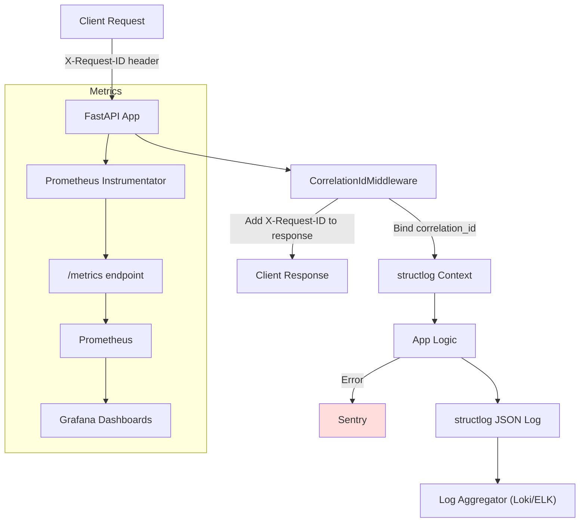

# LLM Output Processor - Architecture Overview

## System Diagram
```
[Client] --> [FastAPI App] --> [OpenAI Embeddings API]
                      |
                      v
                 [Qdrant Vector DB]
```

## Components

### 1. FastAPI Application
- Exposes REST endpoints:
  - `/health`
  - `/ingest`
  - `/search`
- Applies token-based authorization.

### 2. OpenAI Embedding Client
- Uses `text-embedding-3-small` via OpenAI API.
- Embeddings generated with retry + backoff logic.

### 3. Qdrant Vector Database
- Stores and indexes embeddings.
- Configured for 1536-dimension vectors using Cosine distance.

## Data Flow

1. **Ingest**
   - Input text ➡ OpenAI Embedding ➡ Stored in Qdrant.

2. **Search**
   - Query text ➡ OpenAI Embedding ➡ Similar vectors retrieved from Qdrant.

## Configuration

All settings centralized in `config.py` and `.env`:
- API keys
- Model names
- Qdrant host/port
- Retry configurations
- Logging levels and paths

### Logging & Monitoring Architecture



*For editing or viewing the diagram source, see [`docs/logging_monitoring_architecture.mmd`](./logging_monitoring_architecture.mmd).* 

## Testing

- Unit and integration tests available via:
```bash
make test
```
- Tests validate ingestion, search, and health checks.
- See [Testing Guide](./TESTING.md) for our approach to mocking OpenAI and Qdrant in integration tests.

## Metrics & Monitoring

- **Prometheus Metrics:**
  - The API exposes a `/metrics` endpoint (not in OpenAPI schema) for Prometheus scraping.
  - All FastAPI endpoints are instrumented for request count, latency, and error metrics.
  - Enable by default; scrape `/metrics` with your Prometheus server.

- **Sentry Error Monitoring:**
  - If the `SENTRY_DSN` environment variable is set, all unhandled exceptions and traces are sent to Sentry.
  - Configure your Sentry DSN in the environment to enable.
