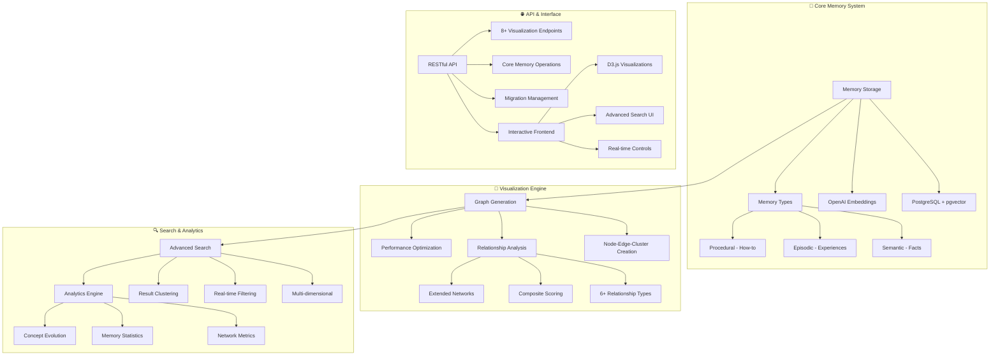

# Architecture - Second Brain v2.2.0

## Overview

Second Brain v2.2.0 represents a revolutionary advancement in personal knowledge management, introducing sophisticated interactive memory visualization while maintaining the clean, minimal architecture established in v2.0.0. The system now provides powerful graph-based exploration of memory relationships alongside efficient storage and retrieval.

## Architecture Principles

### **Simplicity with Power**
- **Single Storage System**: PostgreSQL with pgvector extension
- **Direct Database Access**: Pure SQL with asyncpg for maximum performance
- **Selective Complexity**: Advanced features (visualization) built on simple foundation
- **Environment Configuration**: Simple .env variables with sensible defaults

### **Performance & Scalability**
- **Optimized Core**: 165-line main application maintained
- **Efficient Visualization**: Batch processing with progress tracking
- **Vector Search**: PostgreSQL pgvector with HNSW/IVFFlat indexing
- **Memory Management**: Streaming algorithms for large datasets

### **Interactive Intelligence**
- **Real-time Exploration**: D3.js-powered interactive visualizations
- **Relationship Discovery**: 6+ relationship types with composite scoring
- **Smart Clustering**: Multiple algorithms (K-means, DBSCAN, semantic)
- **Multi-dimensional Search**: Semantic, temporal, importance, hybrid modes

## System Architecture



## Component Architecture

### **Core Application Layer** (`app/app.py`)
```python
FastAPI Application (165 lines - maintained simplicity)
├── Health Check Endpoint
├── Memory CRUD Operations  
├── Advanced Search Endpoint
├── Visualization Route Integration
├── Authentication Middleware
└── Error Handling
```

**Key Features:**
- RESTful API with FastAPI framework
- Pydantic models for request/response validation
- Token-based authentication with environment variables
- Comprehensive error handling with secure responses
- CORS support for web clients
- Route organization with modular design

### **Memory Visualization Engine** (`app/memory_visualization.py`)
```python
Advanced Visualization System (500+ lines)
├── Graph Generation Engine
│   ├── Node Creation with Importance Scaling
│   ├── Edge Generation with Similarity Scoring
│   ├── Cluster Detection and Boundary Creation
│   └── 2D Position Calculation with PCA
├── Relationship Analysis
│   ├── Semantic Similarity (Cosine)
│   ├── Temporal Proximity (Exponential Decay)
│   ├── Content Overlap (Jaccard)
│   ├── Conceptual Hierarchy (Pattern Matching)
│   ├── Causal Relationships (Linguistic Analysis)
│   └── Contextual Association (Metadata)
├── Clustering Algorithms
│   ├── K-means with Adaptive Parameters
│   ├── DBSCAN for Density-based Groups
│   └── Semantic Clustering with Topic Analysis
└── Performance Optimization
    ├── Batch Processing with Progress Tracking
    ├── Memory-efficient Streaming
    └── Configurable Graph Limits
```

### **Advanced Search Engine** (`app/memory_visualization.py`)
```python
Multi-dimensional Search System
├── Search Type Processing
│   ├── Semantic Search (Vector Similarity)
│   ├── Temporal Search (Time-based Patterns)
│   ├── Importance Search (Relevance Weighted)
│   └── Hybrid Search (Combined Scoring)
├── Real-time Filtering
│   ├── Memory Type Filtering
│   ├── Importance Range Filtering
│   ├── Date Range Filtering
│   └── Topic Keyword Filtering
├── Result Analysis
│   ├── Automatic Clustering
│   ├── Relationship Detection
│   └── Pattern Recognition
└── Analytics Integration
    ├── Search Performance Metrics
    ├── Result Quality Scoring
    └── Optimization Insights
```

### **Relationship Analysis System** (`app/memory_relationships.py`)
```python
Comprehensive Relationship Engine
├── Relationship Detection
│   ├── Semantic Similarity Analysis
│   ├── Temporal Proximity Calculation
│   ├── Content Overlap Detection
│   ├── Conceptual Hierarchy Recognition
│   ├── Causal Pattern Detection
│   └── Contextual Association Analysis
├── Network Analysis
│   ├── Extended Network Traversal
│   ├── Multi-level Relationship Mapping
│   ├── Network Topology Metrics
│   └── Clustering Coefficient Calculation
├── Temporal Pattern Analysis
│   ├── Concept Evolution Tracking
│   ├── Relationship Drift Detection
│   └── Time-based Grouping
└── Performance Optimization
    ├── Batch Relationship Processing
    ├── Caching for Frequent Queries
    └── Parallel Analysis Execution
```

### **Database Layer** (`app/database.py`)
```python
PostgreSQL Client with Cognitive Features (400+ lines)
├── Connection Pool Management
├── Enhanced Schema with Memory Types
│   ├── Memory Type Enum (semantic, episodic, procedural)
│   ├── Cognitive Metadata Fields
│   ├── Importance Scoring System
│   └── Vector Embedding Storage
├── Vector Embedding Integration
│   ├── OpenAI API Integration
│   ├── Embedding Generation and Storage
│   └── Similarity Search Operations
├── Advanced Search Capabilities
│   ├── Multi-dimensional Scoring
│   ├── Contextual Relevance Calculation
│   └── Performance-optimized Queries
└── Index Management
    ├── HNSW Index for Large Datasets
    ├── IVFFlat Fallback Index
    └── Importance-weighted Indexing
```

### **Interactive Frontend** (`static/memory_visualization.html`)
```html
D3.js Visualization Interface (1000+ lines)
├── Graph Visualization
│   ├── Force-directed Layout with Physics
│   ├── Node Rendering with Importance Scaling
│   ├── Edge Rendering with Relationship Strength
│   └── Cluster Boundary Visualization
├── Interactive Controls
│   ├── Real-time Search and Filtering
│   ├── Zoom, Pan, and Selection
│   ├── Dynamic Parameter Adjustment
│   └── Graph Layout Controls
├── Analytics Sidebar
│   ├── Live Graph Statistics
│   ├── Selected Memory Details
│   ├── Cluster Information
│   └── Search Results Display
└── Performance Optimization
    ├── Efficient DOM Manipulation
    ├── Smooth Animation Transitions
    └── Responsive Design Patterns
```

### **API Route Layer** (`app/routes/`)
```python
Modular Route Organization
├── visualization_routes.py (Visualization APIs)
│   ├── Graph Generation Endpoints
│   ├── Advanced Search Endpoints
│   ├── Relationship Analysis Endpoints
│   └── Analytics and Health Endpoints
├── memory_routes.py (Core Memory Operations)
│   ├── Memory CRUD Operations
│   ├── Semantic Search Endpoints
│   └── Bulk Operation Endpoints
├── migration_routes.py (Migration Management)
│   ├── Migration Listing and Status
│   ├── Migration Execution Endpoints
│   └── Rollback and Recovery
└── health_routes.py (System Health)
    ├── Application Health Checks
    ├── Database Connection Validation
    └── Performance Metrics
```

## Data Flow Architecture

### **Memory Storage Flow**
```
Input Text → Content Analysis → Memory Type Classification → Embedding Generation → PostgreSQL Storage → Index Update → Response
```

1. **Input Validation**: Pydantic models validate and sanitize incoming requests
2. **Content Analysis**: Intelligent classification of memory type (semantic/episodic/procedural)
3. **Embedding Generation**: OpenAI API generates 1536-dimensional semantic vectors
4. **Cognitive Metadata**: Extraction of domain-specific metadata and importance scoring
5. **Database Storage**: PostgreSQL stores content, metadata, embeddings, and relationships
6. **Index Management**: Automatic HNSW/IVFFlat index updates for performance
7. **Response**: Return memory ID, metadata, and classification results

### **Visualization Generation Flow**
```
Request Parameters → Memory Query → Relationship Analysis → Graph Generation → Clustering → Frontend Rendering
```

1. **Parameter Processing**: Validate and process visualization parameters
2. **Memory Retrieval**: Query memories based on filters (type, importance, time)
3. **Relationship Analysis**: Calculate 6+ relationship types with composite scoring
4. **Graph Generation**: Create nodes, edges, and clusters with position calculation
5. **Clustering**: Apply selected algorithm (K-means, DBSCAN, semantic)
6. **Data Optimization**: Optimize data structure for frontend rendering
7. **Frontend Delivery**: Send graph data to D3.js visualization interface

### **Advanced Search Flow**
```
Search Query → Multi-dimensional Analysis → Result Retrieval → Clustering → Relationship Detection → Response
```

1. **Query Processing**: Parse and analyze search query with type determination
2. **Multi-dimensional Scoring**: Apply semantic, temporal, and importance factors
3. **Result Retrieval**: Execute optimized database queries with filtering
4. **Result Clustering**: Automatic grouping of results by similarity
5. **Relationship Detection**: Identify connections between search results
6. **Analytics Calculation**: Generate search performance and quality metrics
7. **Response Formatting**: Return structured results with metadata and insights

## Database Schema Evolution

### **Enhanced Memory Table (v2.2.0)**
```sql
CREATE TABLE memories (
    id UUID PRIMARY KEY DEFAULT gen_random_uuid(),
    content TEXT NOT NULL,
    embedding vector(1536),
    
    -- Memory Type Classification (v2.1.0+)
    memory_type memory_type_enum NOT NULL DEFAULT 'semantic',
    
    -- Cognitive Metadata (v2.1.0+)
    importance_score DECIMAL(5,4) DEFAULT 0.5000,
    semantic_metadata JSONB DEFAULT '{}',
    episodic_metadata JSONB DEFAULT '{}', 
    procedural_metadata JSONB DEFAULT '{}',
    
    -- Core Metadata (v2.0.0+)
    metadata JSONB DEFAULT '{}',
    created_at TIMESTAMP WITH TIME ZONE DEFAULT CURRENT_TIMESTAMP,
    updated_at TIMESTAMP WITH TIME ZONE DEFAULT CURRENT_TIMESTAMP,
    
    -- Performance Indexes
    CONSTRAINT check_importance_range CHECK (importance_score >= 0 AND importance_score <= 1)
);
```

### **Performance Indexes**
```sql
-- Vector similarity index with importance weighting
CREATE INDEX idx_memories_embedding_weighted 
ON memories USING ivfflat (embedding vector_cosine_ops) 
WHERE importance_score > 0.1000;

-- HNSW index for large datasets (1000+ memories)
CREATE INDEX memories_embedding_hnsw_idx
ON memories USING hnsw (embedding vector_cosine_ops)
WITH (m = 16, ef_construction = 64);

-- Memory type and importance indexes
CREATE INDEX idx_memories_type_importance 
ON memories (memory_type, importance_score DESC);

-- Temporal indexes for time-based queries
CREATE INDEX idx_memories_created_at 
ON memories (created_at DESC);
```

## Performance Architecture

### **Vector Search Optimization**
- **Adaptive Indexing**: HNSW for large datasets (1000+), IVFFlat for smaller
- **Index Parameters**: Optimized m=16, ef_construction=64 for balanced performance
- **Importance Filtering**: Weighted indexes excluding low-importance memories
- **Query Planning**: Automatic query optimization based on dataset characteristics

### **Visualization Performance**
- **Batch Processing**: Process large datasets in configurable batches
- **Progress Tracking**: Real-time progress updates with ETA calculations
- **Memory Management**: Streaming algorithms for memory-efficient processing
- **Caching Strategy**: Intelligent caching of frequently requested graph data

### **Frontend Optimization**
- **Efficient Rendering**: Optimized D3.js patterns for smooth animations
- **Data Streaming**: Incremental loading for large graphs
- **Responsive Updates**: Efficient DOM manipulation for real-time filtering
- **Memory Management**: Proper cleanup of visualization resources

## Security Architecture

### **Authentication & Authorization**
- **API Key Authentication**: Environment-based secure key management
- **Request Validation**: Comprehensive Pydantic model validation
- **Rate Limiting**: Configurable per-endpoint request limits
- **CORS Configuration**: Secure cross-origin request handling

### **Input Sanitization**
- **Content Validation**: Strict input validation for all user content
- **Parameter Bounds**: Enforced limits on visualization parameters
- **SQL Injection Protection**: Parameterized queries throughout
- **Error Handling**: Secure error responses without information leakage

### **Data Protection**
- **Environment Variables**: Secure credential management
- **Connection Security**: Encrypted database connections
- **API Endpoint Security**: Protected routes with authentication
- **Audit Logging**: Comprehensive request and error logging

## Deployment Architecture

### **Single Service Model**
```
Client → FastAPI App → PostgreSQL + pgvector
```

**Benefits:**
- Simple deployment with minimal infrastructure
- Direct database access for optimal performance
- Easy horizontal scaling with multiple instances
- Reduced complexity and operational overhead

### **Container Architecture**
```dockerfile
# Multi-stage build for production optimization
FROM python:3.10-slim AS base
FROM base AS dependencies  
FROM dependencies AS application
```

**Features:**
- Multi-stage builds for minimal image size
- Security-optimized base images
- Environment-specific configurations
- Health check integration

### **Database Requirements**
- **PostgreSQL 15+**: Required for optimal pgvector performance
- **pgvector Extension**: Vector similarity search capabilities
- **Connection Pooling**: Minimum 5, maximum 20 connections
- **Memory**: 4GB+ recommended for large datasets

## Migration Architecture

### **Schema Evolution**
- **Version Management**: Semantic versioning with automated tracking
- **Migration Scripts**: Automated database schema updates
- **Rollback Support**: Safe rollback capabilities for all migrations
- **Data Preservation**: Careful data migration with validation

### **Breaking Changes**
- **v1.x → v2.0.0**: Complete architecture overhaul
- **v2.0.0 → v2.1.0**: Memory type addition (backward compatible)
- **v2.1.0 → v2.2.0**: Visualization system addition (backward compatible)

## Monitoring & Observability

### **Health Monitoring**
- **Application Health**: `/health` endpoint with comprehensive checks
- **Database Health**: Connection validation and performance metrics
- **Visualization Health**: `/visualization/health` for system status
- **Performance Metrics**: Response time and resource usage tracking

### **Error Handling**
- **Structured Logging**: Consistent log format with contextual information
- **Error Classification**: Categorized error types with appropriate responses
- **Graceful Degradation**: Fallback mechanisms for service resilience
- **Alert Integration**: Configurable alerting for critical issues

## Future Architecture Considerations

### **Scalability Enhancements (v2.3.0+)**
- **Horizontal Scaling**: Multi-instance deployment with load balancing
- **Database Sharding**: Partitioning strategies for massive datasets
- **Caching Layer**: Redis integration for high-frequency data
- **CDN Integration**: Static asset optimization for global access

### **Advanced Features (v3.0.0+)**
- **Microservices**: Service decomposition for specialized scaling
- **Event-Driven Architecture**: Async processing for heavy operations
- **Machine Learning Pipeline**: Advanced AI integration for insights
- **Federated Learning**: Privacy-preserving collaborative intelligence

---

## Architecture Principles Summary

1. **Simplicity**: Clean, minimal core with selective complexity
2. **Performance**: Direct database access with optimized queries
3. **Scalability**: Horizontal scaling with efficient resource usage
4. **Maintainability**: Modular design with clear separation of concerns
5. **Security**: Multi-layer protection with secure defaults
6. **Extensibility**: Plugin architecture for future enhancements

**Result**: Second Brain v2.2.0 achieves the perfect balance of simplicity and power, providing revolutionary visualization capabilities while maintaining the clean, efficient architecture that makes it easy to deploy, maintain, and scale.
