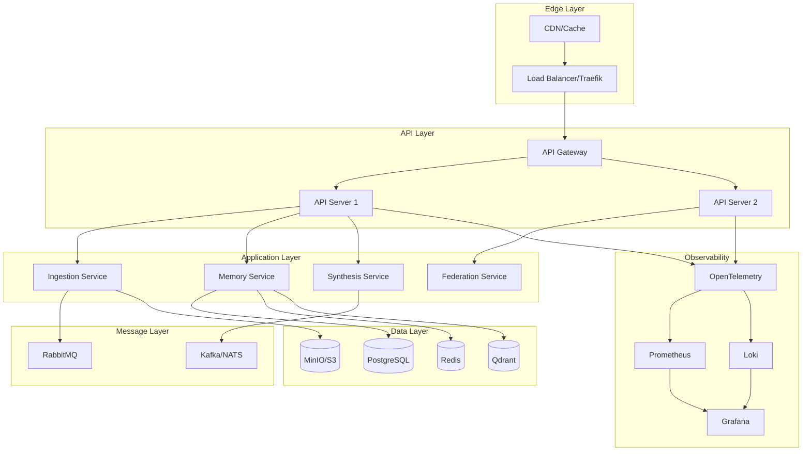
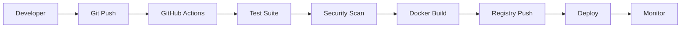

# Second Brain v3.0.0 - Architecture Documentation

## Executive Summary

Second Brain v3.0.0 is a complete architectural redesign focused on:
- **Production readiness** from day one
- **Cloud-native** principles
- **Future-proof** design for distributed deployment
- **Federation** capabilities for multi-brain networks
- **Observability** as a first-class citizen

## Architecture Principles

### 1. Cloud-Native Design
- **12-Factor App** compliance
- **Stateless services** with external state management
- **Container-first** development
- **Configuration through environment**
- **Backing services** as attached resources

### 2. Future-Proof Infrastructure
- **Kubernetes-ready** from the start
- **Service mesh** compatible (Istio/Linkerd)
- **Multi-cloud** deployment support
- **Edge computing** considerations
- **Federation protocol** built-in

### 3. Observability-Driven
- **OpenTelemetry** for distributed tracing
- **Prometheus** metrics everywhere
- **Structured logging** with Loki
- **Real-time dashboards** with Grafana
- **SLO/SLI** monitoring

### 4. Security-First
- **Zero-trust** networking
- **mTLS** between services
- **Secrets management** (Vault-ready)
- **RBAC** at all levels
- **Supply chain security** (signed images)

## System Architecture



## Technology Stack

### Core Technologies
- **Language**: Python 3.11+
- **Framework**: FastAPI (async-first)
- **Database**: PostgreSQL with TimescaleDB
- **Cache**: Redis with Sentinel
- **Vector DB**: Qdrant
- **Object Storage**: MinIO (S3-compatible)
- **Message Queue**: RabbitMQ → Kafka (future)

### Infrastructure
- **Container**: Docker with multi-stage builds
- **Orchestration**: Docker Compose → Kubernetes
- **Service Mesh**: Traefik → Istio (future)
- **Monitoring**: Prometheus + Grafana + Loki
- **Tracing**: OpenTelemetry

## Deployment Architecture

### Local Development
```yaml
# Single machine deployment
docker compose up -d
```

### Production (Single Region)
```yaml
# Docker Swarm deployment
docker stack deploy -c compose.yaml secondbrain
```

### Future: Multi-Region Federation
```
Region A (US-East)          Region B (EU-West)
┌─────────────────┐        ┌─────────────────┐
│  Second Brain   │◄─────►│  Second Brain   │
│   Cluster A     │  gRPC │   Cluster B     │
└─────────────────┘        └─────────────────┘
         │                           │
         └───────────┬───────────────┘
                     │
              ┌──────▼──────┐
              │  Federation  │
              │   Protocol   │
              └─────────────┘
```

## Data Architecture

### Event Sourcing
All changes are captured as events:
```python
@dataclass
class MemoryEvent:
    event_id: str
    event_type: EventType
    aggregate_id: str
    payload: dict
    metadata: EventMetadata
    timestamp: datetime
```

### CQRS Pattern
- **Command Side**: Write operations through event store
- **Query Side**: Optimized read models in PostgreSQL/Qdrant

### Data Flow
1. **Ingestion** → Event Stream → Processing Pipeline
2. **Processing** → Memory Store + Vector Embeddings
3. **Query** → Cached Results → Response

## Federation Protocol

### Design Goals
- **Privacy-first**: User data never leaves their brain without consent
- **Selective sharing**: Fine-grained control over what's shared
- **Peer-to-peer**: No central authority required
- **Conflict resolution**: CRDT-based eventual consistency

### Protocol Stack
```
Application Layer    [Memory Sharing Protocol]
Federation Layer     [Discovery | Auth | Sync]
Transport Layer      [gRPC | WebRTC | QUIC]
Network Layer        [TCP/IP | Tor Optional]
```

## Migration Path

### Phase 1: Local Development (Current)
- Docker Compose deployment
- Single machine operation
- Local storage

### Phase 2: Single Host Production
- Docker Swarm mode
- Automated backups
- Basic monitoring

### Phase 3: Kubernetes Migration
- Helm charts
- Horizontal pod autoscaling
- Multi-zone deployment

### Phase 4: Multi-Region Federation
- Cross-region replication
- Edge deployment
- P2P protocols

### Phase 5: Fully Distributed
- User-owned nodes
- Blockchain integration (optional)
- Decentralized identity

## Security Architecture

### Layers of Security
1. **Network**: mTLS, network policies, firewall rules
2. **Application**: JWT auth, RBAC, input validation
3. **Data**: Encryption at rest, encryption in transit
4. **Operational**: Secrets management, audit logging

### Threat Model
- **External attackers**: Rate limiting, WAF, DDoS protection
- **Insider threats**: Principle of least privilege, audit trails
- **Supply chain**: Signed images, dependency scanning
- **Data exfiltration**: DLP policies, egress controls

## Performance Targets

### SLOs (Service Level Objectives)
- **Availability**: 99.9% uptime
- **Latency**: p99 < 100ms for reads
- **Throughput**: 10,000 req/s per node
- **Storage**: Unlimited with object storage

### Scaling Strategy
- **Horizontal**: Add more containers/pods
- **Vertical**: Increase resource limits
- **Geographic**: Deploy to edge locations
- **Sharding**: Partition by user/tenant

## Development Workflow

### CI/CD Pipeline


### Testing Strategy
- **Unit Tests**: >90% coverage
- **Integration Tests**: All API endpoints
- **E2E Tests**: Critical user journeys
- **Load Tests**: Performance benchmarks
- **Chaos Tests**: Failure injection

## Observability Strategy

### Metrics (Prometheus)
- **RED**: Rate, Errors, Duration
- **USE**: Utilization, Saturation, Errors
- **Business**: Custom KPIs

### Logs (Loki)
- **Structured**: JSON format
- **Correlated**: Trace IDs
- **Searchable**: Full-text search

### Traces (OpenTelemetry)
- **Distributed**: Cross-service tracing
- **Performance**: Bottleneck identification
- **Dependencies**: Service maps

## Cost Optimization

### Resource Management
- **Auto-scaling**: Based on metrics
- **Spot instances**: For batch workloads
- **Reserved capacity**: For baseline
- **Data lifecycle**: Hot/warm/cold storage

### Multi-tenancy
- **Namespace isolation**: Per tenant
- **Resource quotas**: Fair usage
- **Cost attribution**: Per tenant billing

## Future Roadmap

### 2024 Q1-Q2
- ✅ Docker infrastructure
- ✅ Basic federation protocol
- ⬜ Kubernetes migration
- ⬜ Production deployment

### 2024 Q3-Q4
- ⬜ Multi-region deployment
- ⬜ Edge computing support
- ⬜ Mobile clients
- ⬜ P2P protocols

### 2025
- ⬜ Blockchain integration
- ⬜ Decentralized identity
- ⬜ AI model federation
- ⬜ Quantum-resistant crypto

## Getting Started

### Quick Start
```bash
# Clone repository
git clone https://github.com/second-brain/second-brain.git
cd second-brain

# Copy environment
cp .env.example .env

# Start services
docker compose up -d

# Check health
curl http://localhost:8000/health
```

### Production Deployment
See [DEPLOYMENT.md](./DEPLOYMENT.md) for detailed instructions.

## Contributing

See [CONTRIBUTING.md](./CONTRIBUTING.md) for guidelines.

## License

MIT License - see [LICENSE](../LICENSE) for details.