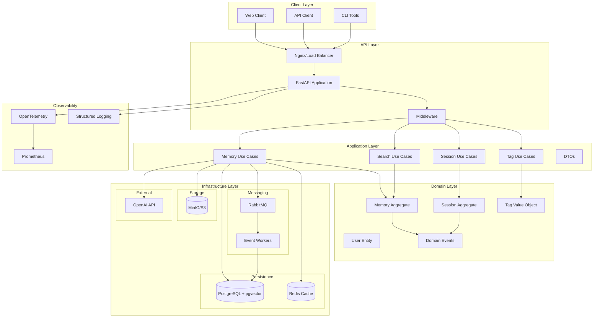

# Second Brain v3.0.0 - Architecture Documentation

## Executive Summary

Second Brain v3.0.0 implements a clean architecture design with domain-driven principles, event sourcing, and enterprise-grade features for production scalability and maintainability.

## Core Architecture Principles

### 1. Clean Architecture
- **Domain-centric**: Business logic isolated from infrastructure
- **Dependency inversion**: All dependencies point inward
- **Testability**: Each layer can be tested independently
- **Flexibility**: Easy to swap infrastructure components

### 2. Domain-Driven Design (DDD)
- **Bounded contexts**: Clear domain boundaries
- **Aggregates**: Consistency boundaries for business rules
- **Value objects**: Immutable domain concepts
- **Domain events**: Decoupled communication

### 3. Event Sourcing & CQRS
- **Event sourcing**: Complete audit trail of all changes
- **CQRS**: Optimized read/write separation
- **Event-driven**: Asynchronous processing
- **Eventual consistency**: Scalable architecture

### 4. Enterprise-Ready
- **Observability**: OpenTelemetry, Prometheus, structured logging
- **Caching**: Redis with multiple strategies
- **Message queue**: RabbitMQ for async processing
- **Object storage**: MinIO/S3 for attachments

## System Architecture



## Directory Structure

```
second-brain/
├── src/
│   ├── domain/                 # Core business logic
│   │   ├── models/            # Entities, aggregates, value objects
│   │   │   ├── memory.py      # Memory aggregate root
│   │   │   ├── session.py     # Session aggregate
│   │   │   ├── tag.py         # Tag value object
│   │   │   └── user.py        # User entity
│   │   ├── events/            # Domain events
│   │   │   ├── base.py        # Event base classes
│   │   │   ├── memory_events.py
│   │   │   ├── session_events.py
│   │   │   └── user_events.py
│   │   └── repositories/      # Repository interfaces
│   │       ├── memory_repository.py
│   │       ├── session_repository.py
│   │       └── event_store.py
│   │
│   ├── application/           # Application business logic
│   │   ├── use_cases/        # Business operations
│   │   │   ├── memory_use_cases.py
│   │   │   ├── session_use_cases.py
│   │   │   └── tag_use_cases.py
│   │   ├── dto/              # Data transfer objects
│   │   │   ├── memory_dto.py
│   │   │   └── session_dto.py
│   │   ├── services/         # Application services
│   │   │   └── attachment_service.py
│   │   └── exceptions.py     # Application exceptions
│   │
│   ├── infrastructure/        # External concerns
│   │   ├── database/         # PostgreSQL implementation
│   │   │   ├── models.py     # SQLAlchemy models
│   │   │   ├── connection.py # Database connection
│   │   │   └── repositories/ # Concrete repositories
│   │   ├── caching/          # Redis implementation
│   │   │   ├── cache.py      # Cache client
│   │   │   ├── strategies.py # Caching strategies
│   │   │   └── decorators.py # Cache decorators
│   │   ├── messaging/        # RabbitMQ implementation
│   │   │   ├── broker.py     # Message broker
│   │   │   ├── publisher.py  # Event publisher
│   │   │   └── handlers.py   # Event handlers
│   │   ├── storage/          # MinIO/S3 implementation
│   │   │   ├── client.py     # Storage client
│   │   │   └── models.py     # Storage models
│   │   ├── embeddings/       # OpenAI integration
│   │   │   └── client.py     # Embedding generator
│   │   └── observability/    # Monitoring
│   │       ├── tracing.py    # OpenTelemetry
│   │       ├── metrics.py    # Prometheus
│   │       └── logging.py    # Structured logging
│   │
│   └── api/                   # API layer
│       ├── app.py            # FastAPI application
│       ├── dependencies.py   # Dependency injection
│       ├── middleware.py     # Cross-cutting concerns
│       ├── exceptions.py     # API exceptions
│       └── routes/           # API endpoints
│           ├── memories.py
│           ├── sessions.py
│           ├── search.py
│           └── health.py
│
├── tests/                     # Test suites
│   ├── unit/                 # Unit tests
│   ├── integration/          # Integration tests
│   └── e2e/                  # End-to-end tests
│
├── migrations/               # Database migrations
├── docker/                   # Docker configurations
├── k8s/                      # Kubernetes manifests
└── docs/                     # Documentation
```

## Data Flow

### 1. Memory Creation Flow
```
Client Request → API Route → Validation → Use Case → Domain Model 
→ Domain Event → Repository → Database → Event Publisher → Message Queue
→ Event Handler → Cache Update → Response
```

### 2. Search Flow
```
Search Request → API Route → Use Case → Cache Check → 
(Cache Miss) → Repository → PostgreSQL Vector Search → 
Cache Update → Response
```

### 3. Event Processing Flow
```
Domain Event → Event Publisher → RabbitMQ → Event Worker →
Event Handler → Side Effects (Cache, Notifications, etc.)
```

## Technology Stack

### Core
- **Language**: Python 3.11+
- **Framework**: FastAPI (async-first)
- **ORM**: SQLAlchemy 2.0 (async)

### Data Layer
- **Primary DB**: PostgreSQL 16 with pgvector
- **Cache**: Redis 7+
- **Message Queue**: RabbitMQ 3.12+
- **Object Storage**: MinIO (S3-compatible)

### Observability
- **Tracing**: OpenTelemetry
- **Metrics**: Prometheus
- **Logging**: Structured JSON logs

### Development
- **Testing**: pytest, pytest-asyncio
- **Linting**: Black, Ruff, mypy
- **Pre-commit**: Git hooks
- **CI/CD**: GitHub Actions

## Key Design Patterns

### 1. Repository Pattern
```python
# Domain layer (interface)
class MemoryRepository(Protocol):
    async def save(self, memory: Memory) -> Memory:
        ...
    async def find_by_id(self, id: UUID) -> Optional[Memory]:
        ...

# Infrastructure layer (implementation)
class SQLMemoryRepository:
    async def save(self, memory: Memory) -> Memory:
        # PostgreSQL implementation
        ...
```

### 2. Use Case Pattern
```python
class CreateMemoryUseCase:
    def __init__(self, 
                 memory_repo: MemoryRepository,
                 event_publisher: EventPublisher):
        self._memory_repo = memory_repo
        self._publisher = event_publisher
    
    async def execute(self, request: CreateMemoryRequest) -> Memory:
        # Business logic here
        memory = Memory.create(...)
        await self._memory_repo.save(memory)
        await self._publisher.publish(memory.events)
        return memory
```

### 3. Event Sourcing
```python
@dataclass
class MemoryCreatedEvent(DomainEvent):
    memory_id: UUID
    content: str
    user_id: UUID
    created_at: datetime
    
class Memory(AggregateRoot):
    def __init__(self):
        self._events: List[DomainEvent] = []
    
    @classmethod
    def create(cls, content: str, user_id: UUID) -> 'Memory':
        memory = cls()
        event = MemoryCreatedEvent(...)
        memory._apply(event)
        memory._record(event)
        return memory
```

### 4. Caching Strategy
```python
@cache_aside(ttl=300)
async def get_memory(memory_id: UUID) -> Memory:
    return await memory_repository.find_by_id(memory_id)

@cache_invalidate(pattern="memory:*")
async def update_memory(memory: Memory) -> Memory:
    return await memory_repository.save(memory)
```

## Deployment Architecture

### Development
```bash
# Docker Compose with all services
docker-compose -f docker-compose.dev.yml up
```

### Production (Single Instance)
```bash
# Docker Compose production
docker-compose -f docker-compose.prod.yml up -d
```

### Production (Kubernetes)
```yaml
apiVersion: apps/v1
kind: Deployment
metadata:
  name: secondbrain-api
spec:
  replicas: 3
  selector:
    matchLabels:
      app: secondbrain-api
  template:
    spec:
      containers:
      - name: api
        image: secondbrain:v3.0.0
        resources:
          requests:
            memory: "256Mi"
            cpu: "250m"
          limits:
            memory: "512Mi"
            cpu: "500m"
```

## Performance Considerations

### 1. Caching Strategy
- **Read-through**: Lazy loading with cache
- **Write-through**: Update cache on writes
- **Cache-aside**: Manual cache management
- **TTL-based**: Automatic expiration

### 2. Database Optimization
- **Connection pooling**: Async connection pool
- **Query optimization**: Indexed queries
- **Vector search**: Optimized pgvector indexes
- **Batch operations**: Bulk inserts/updates

### 3. Async Processing
- **Non-blocking I/O**: FastAPI async endpoints
- **Background tasks**: RabbitMQ workers
- **Concurrent requests**: asyncio concurrency
- **Rate limiting**: API throttling

## Security Architecture

### 1. Authentication & Authorization
- **JWT tokens**: Stateless authentication
- **API keys**: Service-to-service auth
- **RBAC**: Role-based access control
- **Token refresh**: Secure token rotation

### 2. Data Security
- **Encryption at rest**: Database encryption
- **Encryption in transit**: TLS/SSL
- **Secrets management**: Environment variables
- **Input validation**: Pydantic models

### 3. API Security
- **Rate limiting**: Prevent abuse
- **CORS**: Controlled origins
- **Input sanitization**: SQL injection prevention
- **Error handling**: No sensitive data leakage

## Monitoring & Observability

### 1. Metrics (Prometheus)
```python
# Request metrics
request_duration = Histogram(
    'http_request_duration_seconds',
    'HTTP request latency',
    ['method', 'endpoint', 'status']
)

# Business metrics
memories_created = Counter(
    'memories_created_total',
    'Total memories created'
)
```

### 2. Tracing (OpenTelemetry)
```python
@trace
async def create_memory(request: CreateMemoryRequest):
    with tracer.start_as_current_span("create_memory"):
        # Traced operation
        ...
```

### 3. Logging
```python
logger.info(
    "Memory created",
    extra={
        "memory_id": str(memory.id),
        "user_id": str(user_id),
        "trace_id": get_trace_id()
    }
)
```

## Migration Strategy

### From v2.x to v3.0.0
1. **Data Migration**: Scripts to migrate existing data
2. **API Compatibility**: Temporary compatibility layer
3. **Gradual Migration**: Feature flags for new functionality
4. **Rollback Plan**: Database backups and version control

## Future Enhancements

### Short Term (3-6 months)
- GraphQL API support
- WebSocket real-time updates
- Advanced search capabilities
- Multi-language support

### Long Term (6-12 months)
- Microservices architecture
- Event streaming (Kafka)
- Machine learning pipeline
- Federation protocol

## Getting Started

See [README.md](../README.md) for quick start instructions.

## Contributing

See [CONTRIBUTING.md](../CONTRIBUTING.md) for development guidelines.