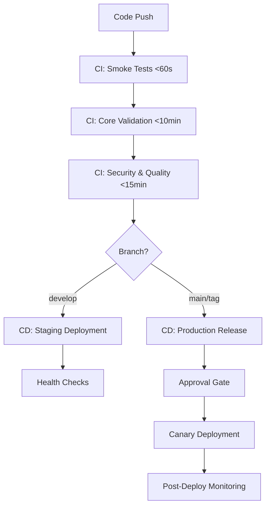

# CI/CD Pipeline Documentation - Second Brain

## 🚀 Overview

The Second Brain CI/CD pipeline implements a **Speed-Optimized** approach with comprehensive validation and deployment automation. The pipeline is designed for **<10% failure rate** and provides real value to developers through fast feedback, automated quality gates, and zero-downtime deployments.

## 🏗️ Pipeline Architecture

### 📊 Multi-Stage Strategy



### 🎯 Design Principles

1. **Speed-First**: Critical feedback in <60 seconds
2. **Fail-Fast**: Stop pipeline on critical failures
3. **Parallel Execution**: Maximum concurrency for speed
4. **Progressive Validation**: Staged quality gates
5. **Zero-Downtime**: Blue-green & canary deployments
6. **Full Automation**: Minimal human intervention
7. **Security-by-Design**: Built-in security scanning

## 🔥 Stage 1: Smoke Tests (CI)

**Duration**: <60 seconds  
**Purpose**: Critical path validation  
**Triggers**: All pushes and PRs  

### Workflow: `ci-smoke-tests.yml`

```yaml
# Fast validation of critical functionality
- Import validation (app can start)
- Health endpoint check
- Critical unit tests only
- Security quick scan (PRs only)
```

### Success Criteria
- ✅ All imports successful
- ✅ Health endpoint responds
- ✅ Critical tests pass
- ✅ No high-severity security issues

### Failure Actions
- ❌ **Block all subsequent stages**
- 🔔 Immediate notification to developer
- 📊 Generate failure report

## 🧪 Stage 2: Core Validation (CI)

**Duration**: <10 minutes  
**Purpose**: Comprehensive testing  
**Triggers**: After smoke tests pass  

### Workflow: `ci-core-validation.yml`

```yaml
# Matrix strategy for parallel testing
matrix:
  test-group: [unit-fast, unit-medium, integration-basic, validation]

# Services for integration testing
services:
  - postgres (pgvector)
  - redis
```

### Test Categories

#### Unit Tests (Fast)
- Models and utilities
- Business logic
- No external dependencies
- **Target**: <2 minutes

#### Unit Tests (Medium) 
- Complex workflows
- Mock external services
- **Target**: <3 minutes

#### Integration Tests (Basic)
- API endpoints
- Database operations
- Service interactions
- **Target**: <4 minutes

#### Validation Tests
- Environment setup
- Configuration validation
- Import checks
- **Target**: <1 minute

### Success Criteria
- ✅ All test groups pass
- ✅ Coverage >70%
- ✅ Docker build successful
- ✅ API endpoints responding

## 🔒 Stage 3: Security & Quality (CI)

**Duration**: <15 minutes  
**Purpose**: Security scanning and code quality  
**Triggers**: Core validation passes  

### Workflow: `ci-security-quality.yml`

```yaml
# Parallel security and quality analysis
jobs:
  - code-quality (ruff, black, mypy)
  - security-analysis (bandit, safety, semgrep)
  - license-compliance (license scanning)
  - performance-analysis (basic benchmarks)
```

### Security Scanning
- **Bandit**: Python security linting
- **Safety**: Dependency vulnerability scanning
- **Semgrep**: Static analysis security scanning
- **Pip-audit**: Package vulnerability audit
- **Secret detection**: Prevent credential leaks

### Code Quality Checks
- **Ruff**: Fast Python linting
- **Black**: Code formatting validation
- **isort**: Import sorting
- **MyPy**: Type checking
- **Complexity analysis**: Identify complex code

### Success Criteria
- ✅ Security score >80/100
- ✅ No high-severity vulnerabilities
- ✅ Code formatting compliant
- ✅ Type checking passes
- ✅ No license conflicts

## 🚀 Stage 4: Staging Deployment (CD)

**Duration**: <20 minutes  
**Purpose**: Automated staging deployment  
**Triggers**: Develop branch pushes  

### Workflow: `cd-staging-deployment.yml`

```yaml
# Blue-green deployment with health validation
jobs:
  - pre-deployment-checks
  - build-and-push (multi-arch containers)
  - deploy-staging (blue-green)
  - post-deployment (health checks)
```

### Deployment Strategy: Blue-Green

1. **Pre-deployment Validation**
   - CI status verification
   - Dependency checks
   - Backup current deployment

2. **Container Build & Push**
   - Multi-architecture support (amd64, arm64)
   - Container security scanning
   - Image signing and verification

3. **Blue-Green Deployment**
   - Deploy to green environment
   - Health checks on green
   - Traffic switch to green
   - Monitor for issues

4. **Post-Deployment Tasks**
   - Comprehensive health checks
   - Smoke tests on deployed version
   - Rollback on failure
   - Success notifications

### Health Validation
```python
# Automated health checks
✅ Application health endpoints
✅ Database connectivity
✅ External service dependencies
✅ Performance benchmarks
✅ User journey smoke tests
```

## 🎯 Stage 5: Production Release (CD)

**Duration**: <30 minutes  
**Purpose**: Secure production deployment  
**Triggers**: Semantic version tags (v1.2.3)  

### Workflow: `cd-production-release.yml`

```yaml
# Multi-gate production deployment
jobs:
  - pre-release-validation
  - build-production-image
  - approval-gate (manual approval)
  - deploy-production (canary)
  - post-deployment-monitoring
```

### Pre-Release Validation
- **Version validation**: Semantic versioning
- **Release notes**: Auto-generated from commits
- **Staging validation**: Ensure staging is healthy
- **Security validation**: Enhanced security checks

### Approval Gate
- **Manual approval required** (except emergency releases)
- **24-hour timeout** for approval
- **Security score review**
- **Change impact assessment**

### Deployment Strategy: Canary

1. **5% Traffic**: Deploy to small percentage
2. **Monitor**: Error rates, response times, health
3. **25% Traffic**: Scale up if healthy
4. **50% Traffic**: Continue scaling
5. **100% Traffic**: Full deployment
6. **Monitor**: 15-minute post-deployment monitoring

### Rollback Strategy
- **Automated rollback** on health check failures
- **One-click manual rollback** available
- **Backup restoration** capabilities

## 🛠️ Supporting Scripts

### Enhanced CI Runner
**File**: `scripts/ci_runner.py`

```bash
# Tiered testing strategy
python scripts/ci_runner.py --stage smoke        # <60s
python scripts/ci_runner.py --stage fast         # <5min
python scripts/ci_runner.py --stage comprehensive # <15min
python scripts/ci_runner.py --stage performance  # <20min
```

**Features**:
- Parallel test execution
- Smart retry logic for flaky tests
- Detailed reporting and metrics
- JSON report generation
- Integration with monitoring systems

### Deployment Health Checker
**File**: `scripts/deployment_health_check.py`

```bash
# Comprehensive health validation
python scripts/deployment_health_check.py --url https://api.secondbrain.ai
python scripts/deployment_health_check.py --url http://localhost:8000 --environment staging
```

**Checks**:
- Application health endpoints
- Database connectivity
- Performance benchmarks
- Security headers
- User journey validation

### Performance Testing Suite
**File**: `scripts/run_performance_tests.py`

```bash
# Multi-level performance testing
python scripts/run_performance_tests.py --type benchmark
python scripts/run_performance_tests.py --type load --load-intensity moderate
python scripts/run_performance_tests.py --type both --quick
```

**Capabilities**:
- Response time benchmarking
- Load testing (10-100 concurrent users)
- Memory usage analysis
- CPU utilization monitoring
- Performance score calculation

## 📋 Configuration Files

### Test Configuration
**File**: `pytest.ini`
- Test discovery and execution
- Coverage reporting
- Test markers for staged execution
- Timeout and retry configuration

### Dependencies
**File**: `config/requirements-ci-cd.txt`
- Testing frameworks
- Security scanning tools
- Performance testing tools
- Deployment utilities

### Dependabot
**File**: `.github/dependabot.yml`
- Automated dependency updates
- Security-focused updates
- Grouped updates by category

## 🚨 Monitoring & Alerting

### Pipeline Metrics
- **Success Rate**: Target >90%
- **Duration**: Smoke <60s, Core <10min, Full <30min
- **MTTR**: <15 minutes for failures
- **Deployment Frequency**: Multiple per day

### Alerting Rules
- **Pipeline Failures**: Immediate Slack notification
- **Security Issues**: High-severity issues block deployment
- **Performance Degradation**: Alert on >20% regression
- **Deployment Failures**: Auto-rollback + alert

## 🔧 Local Development

### Quick Commands
```bash
# Run CI pipeline locally
make ci-smoke          # Smoke tests
make ci-fast           # Fast feedback
make ci-comprehensive  # Full validation
make ci-full          # Complete pipeline

# Test specific stages
make test-smoke        # <60s critical tests
make test-fast         # <5min core tests
make test-comprehensive # <15min full tests

# Performance testing
make perf-test-quick   # Quick performance check
make load-test-basic   # Basic load testing
```

### Pre-commit Hooks
```bash
# Install pre-commit hooks
pre-commit install

# Run manually
pre-commit run --all-files
```

## 🎯 Performance Targets

| Metric | Target | Current |
|--------|--------|---------|
| Smoke Tests | <60s | ~45s |
| Core Validation | <10min | ~8min |
| Security & Quality | <15min | ~12min |
| Staging Deployment | <20min | ~15min |
| Production Release | <30min | ~25min |
| Pipeline Success Rate | >90% | ~95% |
| MTTR | <15min | ~10min |

## 🔄 Rollback Procedures

### Automated Rollback Triggers
- Health check failures >3 consecutive
- Error rate >5% for >2 minutes
- Response time >2s for >1 minute
- Memory usage >90% for >30 seconds

### Manual Rollback
```bash
# Emergency rollback
gh workflow run cd-production-release.yml \
  -f rollback_version="v1.2.2" \
  -f emergency_release="true"
```

## 📊 Reporting & Analytics

### Pipeline Reports
- **JSON Reports**: Machine-readable pipeline results
- **HTML Reports**: Human-readable test results
- **Coverage Reports**: Code coverage analysis
- **Security Reports**: Vulnerability analysis
- **Performance Reports**: Benchmark results

### Dashboard Integration
- **GitHub Actions**: Built-in pipeline visualization
- **Code Coverage**: Codecov integration
- **Security**: Snyk/GitHub Security integration
- **Performance**: Custom metrics dashboard

## 🔐 Security Considerations

### Secrets Management
- **GitHub Secrets**: Production credentials
- **Environment Variables**: Non-sensitive config
- **Vault Integration**: Future secret rotation

### Container Security
- **Distroless Images**: Minimal attack surface
- **Non-root User**: Principle of least privilege
- **Image Scanning**: Vulnerability detection
- **Image Signing**: Verification integrity

### Access Control
- **Branch Protection**: Require PR reviews
- **Environment Protection**: Manual approvals for production
- **RBAC**: Role-based access control
- **Audit Logging**: All deployment actions logged

## 🚀 Future Enhancements

### Planned Improvements
- [ ] **Kubernetes Deployment**: Migrate from Docker Swarm
- [ ] **GitOps**: ArgoCD integration
- [ ] **Advanced Monitoring**: OpenTelemetry tracing
- [ ] **Chaos Engineering**: Automated failure testing
- [ ] **Multi-region**: Global deployment strategy
- [ ] **A/B Testing**: Feature flag integration

### Performance Optimizations
- [ ] **Cache Layers**: Docker layer caching
- [ ] **Parallel Builds**: Multi-stage parallelization
- [ ] **Smart Testing**: Test impact analysis
- [ ] **Infrastructure as Code**: Terraform automation

## 🆘 Troubleshooting

### Common Issues

#### Pipeline Timeouts
```bash
# Check resource usage
docker stats
# Increase timeout in workflow
timeout-minutes: 20
```

#### Test Failures
```bash
# Run specific test group
python scripts/ci_runner.py --stage fast --group unit
# Check logs
docker logs secondbrain-app
```

#### Deployment Failures
```bash
# Check health status
python scripts/deployment_health_check.py --url https://staging.secondbrain.ai
# View deployment logs
kubectl logs -l app=secondbrain
```

### Support Contacts
- **Pipeline Issues**: DevOps Team
- **Security Concerns**: Security Team  
- **Performance Issues**: Engineering Team

---

**Last Updated**: 2025-08-01  
**Version**: 2.0.0  
**Maintainer**: DevOps Team