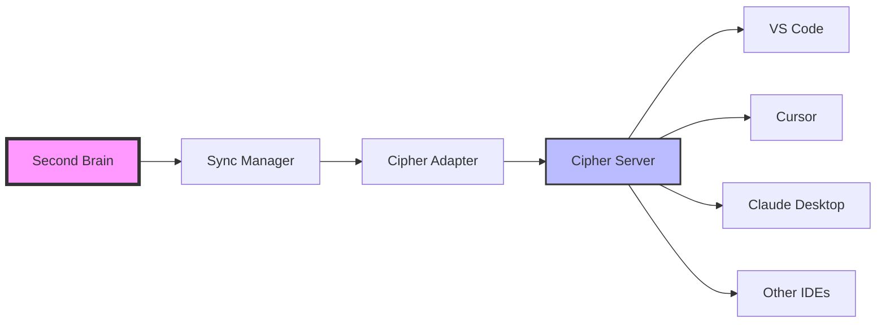

# Cipher Integration Guide - Second Brain v4.2.3

## Overview

Second Brain now supports **optional** integration with [Cipher](https://github.com/campfirein/cipher), an AI memory layer designed for coding agents. This integration is completely optional - Second Brain works perfectly as a standalone system.

## What is Cipher?

Cipher provides:
- **Cross-IDE Memory Persistence**: Memories follow you across VS Code, Cursor, Claude Desktop, Windsurf, and more
- **MCP Protocol Support**: Native integration with AI coding assistants
- **Dual Memory System**: 
  - System 1: Programming concepts, patterns, and business logic
  - System 2: AI reasoning steps and decision paths
- **Team Knowledge Sharing**: Automatic synchronization across team members

## Integration Architecture



## Use Cases

### 1. Solo Developer (Standalone)
- Use Second Brain without Cipher
- Full feature set via web UI and API
- No additional configuration needed

### 2. AI-IDE User (Second Brain + Cipher Sync)
- Enable Cipher sync for IDE integration
- Memories available in your AI coding assistant
- Best for developers using Cursor, Windsurf, etc.

### 3. Development Team (Full Integration)
- Second Brain for long-term knowledge persistence
- Cipher for real-time IDE sharing
- Team members see each other's learned patterns

## Quick Start

### Step 1: Install Cipher (Optional)

If you want IDE integration, install Cipher:

```bash
# Option 1: Global installation
npm install -g @byterover/cipher

# Option 2: Docker
git clone https://github.com/campfirein/cipher.git
cd cipher
docker-compose up -d
```

### Step 2: Configure Second Brain

Add to your `.env` file:

```bash
# Enable Cipher integration
CIPHER_ENABLED=true

# Cipher server URL (local or hosted)
CIPHER_URL=http://localhost:3000

# Optional: For Byterover hosted service
# CIPHER_API_KEY=your-api-key

# Optional: For team sync
# CIPHER_WORKSPACE_ID=your-workspace-id

# Sync settings
CIPHER_SYNC_INTERVAL=300  # 5 minutes
CIPHER_ENABLE_MCP=true
CIPHER_CONFLICT_RESOLUTION=newest  # or: local, remote
```

### Step 3: Start Second Brain

```bash
# Second Brain will automatically detect and connect to Cipher
docker-compose up -d

# Or for local development
make dev
```

### Step 4: Configure Your IDE

For VS Code/Cursor with MCP:

```json
{
  "mcpServers": {
    "cipher": {
      "command": "npx",
      "args": ["@byterover/cipher", "mcp"],
      "env": {
        "CIPHER_API_URL": "http://localhost:3000",
        "SECOND_BRAIN_SYNC": "true"
      }
    }
  }
}
```

## Configuration Options

### Environment Variables

| Variable | Default | Description |
|----------|---------|-------------|
| `CIPHER_ENABLED` | `false` | Enable/disable Cipher integration |
| `CIPHER_URL` | `http://localhost:3000` | Cipher server URL |
| `CIPHER_API_KEY` | `""` | API key for hosted Byterover |
| `CIPHER_WORKSPACE_ID` | `""` | Workspace ID for team sharing |
| `CIPHER_SYNC_INTERVAL` | `300` | Seconds between syncs |
| `CIPHER_ENABLE_MCP` | `true` | Enable real-time MCP sync |
| `CIPHER_CONFLICT_RESOLUTION` | `newest` | How to resolve conflicts |

### Conflict Resolution Strategies

- **`local`**: Second Brain always wins
- **`remote`**: Cipher always wins  
- **`newest`**: Most recently updated wins (default)
- **`manual`**: Future feature for custom resolution

### Sync Filters

You can control what gets synced by tags or type:

```python
# In your app configuration
CIPHER_SYNC_FILTERS = {
    "include_tags": ["code", "pattern", "algorithm"],
    "exclude_tags": ["personal", "draft"],
    "include_types": ["code", "reasoning"],
    "exclude_types": ["general", "note"]
}
```

## Monitoring Integration

### Check Sync Status

```bash
# Via API
curl http://localhost:8000/api/v2/sync/status

# Response
{
  "providers": {
    "cipher": {
      "healthy": true,
      "connected": true,
      "last_sync": "2025-08-09T10:30:00Z",
      "memories_synced": 1523,
      "latency_ms": 45
    }
  }
}
```

### Manual Sync Trigger

```bash
# Sync all providers
curl -X POST http://localhost:8000/api/v2/sync/all

# Sync only Cipher
curl -X POST http://localhost:8000/api/v2/sync/cipher
```

## Advanced Configuration

### Custom Sync Implementation

Create your own sync provider:

```python
from app.interfaces.sync_provider import ISyncProvider

class CustomProvider(ISyncProvider):
    @property
    def name(self) -> str:
        return "custom"
    
    async def push_memory(self, memory: Dict[str, Any]) -> bool:
        # Your implementation
        pass
```

### Selective Sync

Only sync specific memories:

```python
# Tag-based filtering
memory.tags = ["sync-to-cipher", "team-share"]

# Type-based filtering
memory.type = "code"  # Only code memories sync
```

## Troubleshooting

### Cipher Not Connecting

1. Check Cipher is running:
   ```bash
   curl http://localhost:3000/health
   ```

2. Verify configuration:
   ```bash
   # Check environment
   echo $CIPHER_URL
   echo $CIPHER_ENABLED
   ```

3. Check logs:
   ```bash
   docker-compose logs -f app | grep cipher
   ```

### Sync Not Working

1. Manual sync test:
   ```bash
   curl -X POST http://localhost:8000/api/v2/sync/cipher
   ```

2. Check sync filters in logs

3. Verify API keys if using hosted service

### Performance Issues

- Increase `CIPHER_SYNC_INTERVAL` to reduce frequency
- Use filters to sync fewer memories
- Disable MCP if not needed: `CIPHER_ENABLE_MCP=false`

## Security Considerations

1. **API Keys**: Store securely, never commit to git
2. **Network**: Use HTTPS in production
3. **Filtering**: Exclude sensitive memories from sync
4. **Access Control**: Configure workspace permissions in Cipher

## FAQ

### Do I need Cipher to use Second Brain?
No! Cipher is completely optional. Second Brain is a full-featured standalone system.

### What happens if Cipher is down?
Second Brain continues working normally. Sync will resume when Cipher is available.

### Can I use multiple sync providers?
Yes! The adapter pattern supports multiple providers simultaneously.

### How do conflicts get resolved?
Based on your `CIPHER_CONFLICT_RESOLUTION` setting. Default is newest wins.

### Is my data secure?
- Data is encrypted in transit (HTTPS)
- You control what syncs via filters
- API keys provide authentication
- You can self-host both systems

## Next Steps

1. **Try Standalone First**: Get familiar with Second Brain
2. **Add Cipher Later**: Enable integration when you need IDE features
3. **Configure Filters**: Only sync what you need
4. **Monitor Performance**: Use the sync status endpoint
5. **Join Community**: Share your setup and learn from others

---

Remember: Cipher integration is optional. Start simple, add complexity only when needed.