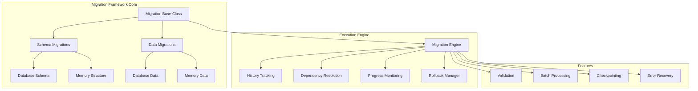

# Unified Migration System for Second Brain

## Overview

The Second Brain Unified Migration System provides a consistent, robust framework for managing both database schema changes and memory data migrations. It combines the best practices from traditional database migration tools with the unique requirements of memory and AI system migrations.

## Key Features

### 🔄 **Unified Architecture**
- **Single Framework**: One consistent API for all migration types
- **Common Patterns**: Shared concepts across database and memory migrations
- **Type Safety**: Full TypeScript/Python type hints throughout
- **Extensible Design**: Easy to add new migration types

### 🛡️ **Safety Features**
- **Transactional Support**: Atomic operations with rollback capability
- **Validation Stages**: Pre and post-condition validation
- **Dry Run Mode**: Test migrations without applying changes
- **Checkpoint System**: Resume interrupted migrations
- **Dependency Resolution**: Automatic ordering of dependent migrations

### 📊 **Progress Tracking**
- **Real-time Updates**: Monitor migration progress
- **ETA Calculation**: Estimated time to completion
- **Performance Metrics**: Detailed execution statistics
- **Audit Trail**: Complete history of all migrations

### ⚡ **Performance**
- **Batch Processing**: Efficient handling of large datasets
- **Parallel Execution**: Optional concurrent processing
- **Memory Optimization**: Streaming for large migrations
- **Connection Pooling**: Reuse database connections

## Migration Types

### 1. **Database Schema Migrations** (`DATABASE_SCHEMA`)
Changes to database structure (DDL operations)
- Table creation/modification
- Index management
- Constraint updates
- Extension installation

### 2. **Database Data Migrations** (`DATABASE_DATA`)
Bulk data transformations (DML operations)
- Data backfilling
- Format conversions
- Data cleanup
- Aggregation updates

### 3. **Memory Structure Migrations** (`MEMORY_STRUCTURE`)
Changes to memory organization
- Memory type classification
- Metadata schema updates
- Embedding format changes

### 4. **Memory Data Migrations** (`MEMORY_DATA`)
Bulk memory transformations
- Content enrichment
- Duplicate consolidation
- Type reclassification
- Importance recalculation

### 5. **Hybrid Migrations** (`HYBRID`)
Combined schema and data changes
- Complex multi-step operations
- Coordinated updates

## Architecture



## Usage Examples

### Creating a Database Schema Migration

```python
from app.database_migrations import DatabaseSchemaMigration
from app.migration_framework import MigrationMetadata, MigrationType
from datetime import datetime

class AddUserPreferencesTable(DatabaseSchemaMigration):
    def _get_metadata(self) -> MigrationMetadata:
        return MigrationMetadata(
            id="add_user_preferences_001",
            name="Add user preferences table",
            description="Creates table for storing user preferences",
            version="2.6.0",
            migration_type=MigrationType.DATABASE_SCHEMA,
            author="system",
            created_at=datetime.now(),
            dependencies=[],
            reversible=True,
            checksum="abc123"
        )
    
    async def get_forward_statements(self) -> List[str]:
        return [
            """
            CREATE TABLE user_preferences (
                id UUID PRIMARY KEY DEFAULT gen_random_uuid(),
                user_id UUID NOT NULL,
                theme VARCHAR(50) DEFAULT 'gruvbox_light',
                notifications_enabled BOOLEAN DEFAULT true,
                created_at TIMESTAMP DEFAULT CURRENT_TIMESTAMP,
                updated_at TIMESTAMP DEFAULT CURRENT_TIMESTAMP
            )
            """,
            "CREATE INDEX idx_user_preferences_user_id ON user_preferences(user_id)"
        ]
    
    async def get_rollback_statements(self) -> List[str]:
        return [
            "DROP TABLE IF EXISTS user_preferences"
        ]
```

### Creating a Memory Data Migration

```python
from app.memory_migrations import MemoryDataMigration
from app.bulk_memory_operations import BulkMemoryItem

class EnrichMemoriesWithSentiment(MemoryDataMigration):
    def _get_metadata(self) -> MigrationMetadata:
        return MigrationMetadata(
            id="enrich_sentiment_001",
            name="Add sentiment analysis to memories",
            description="Analyzes and adds sentiment scores to existing memories",
            version="2.6.0",
            migration_type=MigrationType.MEMORY_DATA,
            author="system",
            created_at=datetime.now(),
            dependencies=["classify_memory_types_001"],
            reversible=True,
            checksum="def456"
        )
    
    async def get_memories_to_migrate(self) -> List[Dict[str, Any]]:
        async with self.pool.acquire() as conn:
            rows = await conn.fetch("""
                SELECT id, content, metadata
                FROM memories
                WHERE metadata->>'sentiment' IS NULL
                LIMIT 10000
            """)
            return [dict(row) for row in rows]
    
    async def transform_memory(self, memory: Dict[str, Any]) -> Optional[BulkMemoryItem]:
        # Analyze sentiment
        sentiment = analyze_sentiment(memory['content'])
        
        # Update metadata
        metadata = memory.get('metadata', {})
        metadata['sentiment'] = {
            'score': sentiment.score,
            'magnitude': sentiment.magnitude,
            'analyzed_at': datetime.now().isoformat()
        }
        
        return BulkMemoryItem(
            memory_id=memory['id'],
            content=memory['content'],
            metadata=metadata
        )
```

### Executing Migrations via API

```bash
# List pending migrations
curl -X GET "http://localhost:8000/migrations/pending"

# Execute specific migration (dry run)
curl -X POST "http://localhost:8000/migrations/execute/add_user_preferences_001" \
  -H "Content-Type: application/json" \
  -d '{
    "dry_run": true,
    "batch_size": 1000,
    "enable_rollback": true
  }'

# Execute all pending database migrations
curl -X POST "http://localhost:8000/migrations/execute-all?migration_type=DATABASE_SCHEMA"

# Check migration progress
curl -X GET "http://localhost:8000/migrations/progress/enrich_sentiment_001"

# Rollback a migration
curl -X POST "http://localhost:8000/migrations/rollback/add_user_preferences_001"
```

## API Endpoints

| Endpoint | Method | Description |
|----------|--------|-------------|
| `/migrations/pending` | GET | List pending migrations |
| `/migrations/history` | GET | View migration history |
| `/migrations/execute/{id}` | POST | Execute specific migration |
| `/migrations/execute-all` | POST | Execute all pending migrations |
| `/migrations/rollback/{id}` | POST | Rollback a migration |
| `/migrations/progress/{id}` | GET | Check migration progress |
| `/migrations/running` | GET | List running migrations |
| `/migrations/validate/{id}` | POST | Validate without executing |

## Best Practices

### 1. **Migration Design**
- Keep migrations focused and atomic
- Always provide rollback for schema changes
- Test migrations thoroughly in development
- Use meaningful IDs and descriptions

### 2. **Dependency Management**
- Explicitly declare dependencies
- Avoid circular dependencies
- Group related migrations

### 3. **Performance Optimization**
- Use appropriate batch sizes (1000-5000)
- Enable parallel processing for large datasets
- Set reasonable timeouts
- Monitor memory usage

### 4. **Error Handling**
- Use continue_on_error for non-critical migrations
- Implement proper validation
- Log detailed error information
- Test rollback procedures

### 5. **Testing Strategy**
- Always run dry run first
- Test on subset of data
- Verify postconditions
- Have rollback plan ready

## Configuration Options

```python
@dataclass
class MigrationConfig:
    # Simulation mode - no changes applied
    dry_run: bool = False
    
    # Number of items per batch
    batch_size: int = 1000
    
    # Enable automatic rollback on failure
    enable_rollback: bool = True
    
    # Validate before execution
    validate_before: bool = True
    
    # Validate after execution
    validate_after: bool = True
    
    # Use multiple workers
    parallel_execution: bool = False
    
    # Checkpoint frequency for resume
    checkpoint_frequency: int = 5000
    
    # Maximum execution time
    timeout_seconds: int = 3600
    
    # Continue processing on individual errors
    continue_on_error: bool = False
```

## Monitoring and Observability

### Progress Tracking
- Real-time progress percentage
- Items processed vs total
- Current batch number
- Estimated time remaining

### Performance Metrics
- Execution time
- Items per second
- Memory usage
- Error rates

### Audit Trail
- Migration history table
- Execution timestamps
- Error details
- Rollback history

## Troubleshooting

### Common Issues

1. **Migration Fails to Start**
   - Check database connectivity
   - Verify migration dependencies
   - Ensure proper permissions

2. **Migration Timeout**
   - Increase timeout_seconds
   - Reduce batch_size
   - Enable checkpointing

3. **Rollback Fails**
   - Check if migration is reversible
   - Verify database state
   - Review error logs

4. **Performance Issues**
   - Optimize batch size
   - Enable parallel execution
   - Add appropriate indexes

## Integration with CI/CD

```yaml
# Example GitHub Action
name: Run Migrations
on:
  push:
    branches: [main]

jobs:
  migrate:
    runs-on: ubuntu-latest
    steps:
      - uses: actions/checkout@v2
      
      - name: Run pending migrations
        run: |
          curl -X POST "${{ secrets.API_URL }}/migrations/execute-all" \
            -H "Authorization: Bearer ${{ secrets.API_TOKEN }}" \
            -H "Content-Type: application/json" \
            -d '{"dry_run": false, "enable_rollback": true}'
```

## Future Enhancements

- **Migration Generator**: CLI tool to scaffold migrations
- **Conflict Detection**: Automatic detection of conflicting migrations
- **Migration Squashing**: Combine multiple migrations
- **Cross-Environment Sync**: Coordinate migrations across environments
- **Visual Migration Timeline**: UI for migration history
- **Automated Testing**: Migration test framework

## Conclusion

The Unified Migration System provides a robust, enterprise-grade solution for managing all types of data and schema migrations in Second Brain. By combining traditional database migration patterns with AI/memory-specific requirements, it offers a consistent, safe, and efficient way to evolve the system over time. 