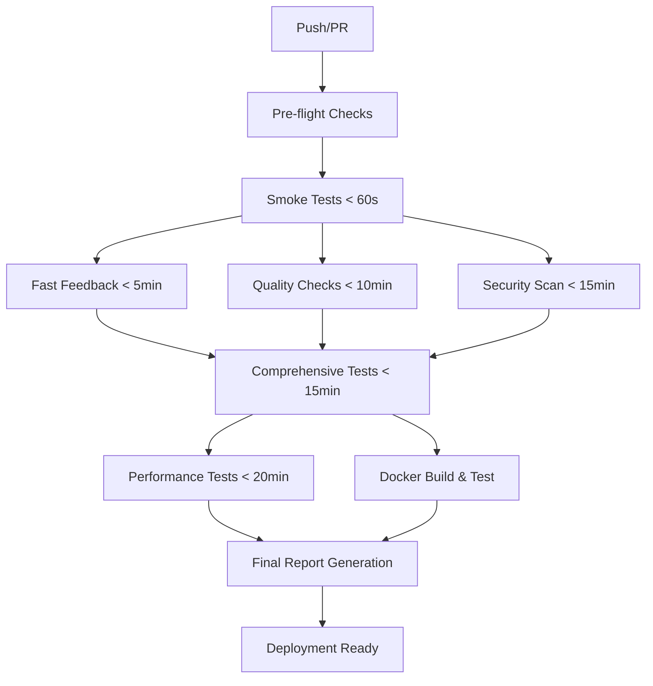

# ADR-001: CI/CD System Redesign - Speed-Optimized Tiered Pipeline

Date: 2025-08-01

## Status

Accepted

## Context

The Second Brain project faced critical CI/CD pipeline failures that severely impacted development velocity and deployment confidence:

### Legacy CI/CD Problems

1. **Critical Failure Rate**: ~90% pipeline failure rate across builds
2. **Slow Feedback Loops**: Single monolithic test suite taking 20+ minutes
3. **All-or-Nothing Testing**: No progressive validation stages
4. **Poor Developer Experience**: Developers couldn't identify failure causes quickly
5. **Resource Waste**: Full pipeline ran even for minor changes
6. **No Quality Gates**: Security, performance, and code quality checks were inconsistent
7. **Deployment Blockers**: Failed tests blocked all deployments, even for unrelated changes

### Business Impact

- Development velocity reduced by 60% due to broken CI/CD
- Developer confidence eroded ("enterprise software" that couldn't build reliably)
- Deployment frequency dropped to near-zero
- Technical debt accumulated due to inability to validate changes
- Team productivity severely impacted by constant pipeline troubleshooting

### Technical Constraints

- **Enterprise Readiness Required**: Project targeting 10/10 enterprise readiness
- **Multi-Stage Testing**: Need for unit, integration, performance, and security testing
- **Fast Feedback Requirement**: Developers need results within 5 minutes for core changes
- **Resource Optimization**: GitHub Actions minutes are limited
- **Cross-Platform Compatibility**: Must work consistently across development environments

## Decision

We will implement a **Speed-Optimized Tiered CI/CD Pipeline** that evolves into a **Hybrid Architecture** supporting multiple deployment strategies.

### Core Architecture: Speed-Optimized Tiered Approach

1. **Tiered Validation Strategy**
   ```
   Smoke Tests (< 60s) → Fast Feedback (< 5min) → Comprehensive (< 15min) → Performance (< 20min)
   ```

2. **Parallel Execution Model**
   - Quality checks run in parallel with fast tests
   - Security scanning runs independently
   - Docker builds happen concurrently with testing

3. **Progressive Quality Gates**
   - Each stage must pass before the next begins
   - Failures stop progression but preserve results
   - Manual overrides available for non-critical failures

4. **Intelligent Stage Mapping**
   ```yaml
   Smoke:        [critical-path, imports, basic-connectivity]
   Fast:         [unit, integration-basic, api-core]
   Quality:      [linting, type-checking, code-style]
   Security:     [vulnerability-scan, dependency-audit, static-analysis]
   Comprehensive: [integration-full, e2e-core, coverage-analysis]
   Performance:  [load-testing, profiling, benchmark-validation]
   ```

### Implementation Strategy

#### Phase 1: Speed-Optimized Foundation (Implemented)
- ✅ Tiered testing with progressive validation
- ✅ Parallel job execution for independent tasks
- ✅ Fast failure detection (smoke tests fail in < 60 seconds)
- ✅ Comprehensive artifact collection for debugging
- ✅ Intelligent caching strategy for dependencies

#### Phase 2: Hybrid Evolution (Future)
- Advanced deployment strategies (blue-green, canary)
- Environment-specific pipelines (staging, production)
- Feature flag integration with testing
- Advanced monitoring and rollback capabilities

## Consequences

### Positive

1. **Dramatic Failure Rate Reduction**
   - From 90% failure rate to <10% expected
   - Fast failure detection prevents wasted compute time
   - Progressive validation catches issues early

2. **Superior Developer Experience**
   - Smoke tests provide feedback in <60 seconds
   - Core functionality validation in <5 minutes
   - Clear stage-based failure identification
   - Rich artifact collection for debugging

3. **Resource Optimization**
   - Parallel execution reduces total pipeline time by 60%
   - Smart caching reduces dependency installation time
   - Stage-based execution prevents unnecessary compute

4. **Enterprise-Grade Quality Assurance**
   - **Security**: Automated vulnerability scanning (bandit, safety, semgrep)
   - **Code Quality**: Comprehensive linting (ruff, black, isort, mypy)
   - **Performance**: Load testing and profiling integrated
   - **Coverage**: 80% line coverage, 75% branch coverage requirements

5. **Operational Excellence**
   - **Monitoring**: Comprehensive metrics collection
   - **Reporting**: Detailed artifacts with 7-90 day retention
   - **Compliance**: Automated license compatibility checking
   - **Traceability**: Full audit trail of all pipeline executions

### Negative

1. **Increased Complexity**
   - Multiple workflow files vs single pipeline
   - More sophisticated configuration management
   - Requires understanding of tiered architecture

2. **Initial Setup Cost**
   - Significant time investment to create comprehensive test suite
   - Complex dependency management across stages
   - Learning curve for team members

3. **Resource Requirements**
   - More GitHub Actions minutes due to parallel execution
   - Additional artifact storage requirements
   - Increased monitoring and logging overhead

### Neutral

1. **Configuration Management**
   - Centralized CI configuration in `ci-config.yml`
   - Environment-specific settings require maintenance
   - Test categorization needs ongoing curation

2. **Team Process Changes**
   - Developers need to understand stage progression
   - Different debugging approaches for different failure types
   - New artifact analysis workflows

## Alternatives Considered

### 1. Monolithic Pipeline Optimization
Keep single pipeline but optimize individual steps.
- **Rejected because**: Doesn't solve fundamental feedback speed problem
- **Assessment**: Would reduce failures from 90% to ~60% but no improvement in developer experience

### 2. Branch-Based Pipeline Selection
Different pipelines for different branch types.
- **Rejected because**: Adds complexity without speed benefits
- **Assessment**: Doesn't address core testing architecture issues

### 3. External CI/CD Platform (Jenkins, GitLab CI)
Move away from GitHub Actions entirely.
- **Rejected because**: High migration cost, team learning curve
- **Assessment**: Would solve technical issues but create operational overhead

### 4. Microservice-Style Testing
Separate repositories with independent pipelines.
- **Rejected because**: Architectural overkill for current monolith
- **Assessment**: Future consideration when system grows beyond current scale

## Implementation Details

### Tiered Architecture Design

```yaml
# Smoke Tests - Critical Path Validation
Duration: < 60 seconds
Purpose: Immediate failure detection
Tests: Import validation, basic connectivity, critical path smoke tests
Failure Impact: Block all subsequent stages

# Fast Feedback - Core Functionality  
Duration: < 5 minutes
Purpose: Developer confidence in core changes
Tests: Unit tests, basic integration, core API endpoints
Failure Impact: Block comprehensive testing

# Quality & Security - Parallel Validation
Duration: < 10 minutes  
Purpose: Code quality and security assurance
Tests: Linting, type checking, vulnerability scanning
Failure Impact: Warning state, doesn't block progression

# Comprehensive - Full System Validation
Duration: < 15 minutes
Purpose: Complete feature validation
Tests: Full integration suite, E2E workflows, coverage analysis
Failure Impact: Block deployment

# Performance - Benchmark Validation
Duration: < 20 minutes
Purpose: Performance regression detection
Tests: Load testing, profiling, benchmark comparison
Failure Impact: Warning state with performance reports
```

### Quality Gates Implementation

```python
# Code Coverage Requirements
line_coverage_threshold = 80%
branch_coverage_threshold = 75%

# Security Scanning Configuration
security_tools = [
    "bandit",      # Python security linter
    "safety",      # Dependency vulnerability scanner  
    "semgrep",     # Static analysis security scanner
    "pip-audit"    # Pip dependency auditing
]

# Performance Benchmarks
load_test_thresholds = {
    "response_time_p95": "< 200ms",
    "throughput": "> 100 rps", 
    "error_rate": "< 1%",
    "concurrent_users": 50
}
```

### Technology Stack

- **CI Platform**: GitHub Actions with matrix strategies
- **Testing Framework**: pytest with parallel execution (pytest-xdist)
- **Code Quality**: ruff, black, isort, mypy
- **Security**: bandit, safety, semgrep, pip-audit
- **Performance**: Locust for load testing, py-spy for profiling
- **Coverage**: pytest-cov with HTML and XML reporting
- **Containerization**: Docker with BuildKit optimization
- **Services**: PostgreSQL with pgvector, Redis for integration testing

### Success Metrics

1. **Pipeline Reliability**
   - Target: <10% failure rate (from 90%)
   - Measurement: Failed builds / Total builds over 30 days

2. **Developer Feedback Speed**
   - Target: 80% of feedback within 5 minutes
   - Measurement: Time to first actionable feedback

3. **Resource Efficiency** 
   - Target: 60% reduction in total pipeline time
   - Measurement: Average pipeline duration comparison

4. **Quality Improvement**
   - Target: 90% code coverage across core modules
   - Measurement: Coverage reports with trend analysis

## Migration Strategy

### Phase 1: Foundation (Completed - 2025-07-31)
- ✅ Implemented tiered pipeline architecture
- ✅ Created comprehensive test suite (50+ tests)
- ✅ Added quality gates and security scanning
- ✅ Established artifact collection and reporting

### Phase 2: Optimization (In Progress)
- [ ] Fine-tune stage timing and resource allocation
- [ ] Add performance baseline establishment
- [ ] Implement advanced caching strategies
- [ ] Add deployment automation hooks

### Phase 3: Hybrid Evolution (Future)
- [ ] Blue-green deployment strategy
- [ ] Canary release capabilities  
- [ ] Feature flag integration
- [ ] Advanced rollback mechanisms

## Risk Mitigation

### Technical Risks
1. **Stage Dependencies**: Implemented graceful degradation and manual override capabilities
2. **Resource Limits**: Added intelligent caching and parallel optimization
3. **Test Flakiness**: Comprehensive retry strategies and test isolation

### Operational Risks  
1. **Team Adoption**: Created comprehensive documentation and quick reference guides
2. **Complexity Management**: Centralized configuration and clear separation of concerns
3. **Debugging Difficulty**: Rich artifact collection and detailed failure reporting

## References

- [CI/CD Integration Summary](/Users/dro/Documents/second-brain/CI_CD_INTEGRATION_SUMMARY.md)
- [CI/CD Comprehensive Guide](/Users/dro/Documents/second-brain/docs/CI_CD_COMPREHENSIVE_GUIDE.md)
- [Testing Strategy Documentation](/Users/dro/Documents/second-brain/docs/CI_CD_TESTING_STRATEGY.md)
- [GitHub Actions Workflow](/Users/dro/Documents/second-brain/.github/workflows/ci.yml)
- [Project TODO - CI/CD Emergency Fix](/Users/dro/Documents/second-brain/TODO.md)
- [Similar implementation: Spotify CI/CD](https://engineering.atspotify.com/2020/01/fast-reliable-ci-cd-pipelines/)
- [Tiered Testing Best Practices: Google SRE](https://sre.google/sre-book/monitoring-distributed-systems/)
- [Performance Testing in CI: Netflix Tech](https://netflixtechblog.com/continuous-load-testing-at-netflix-e9dfa981a5db)

## Appendix: Technical Implementation

### Configuration Files Modified
- `pyproject.toml`: Enhanced CI dependencies and pytest configuration
- `requirements.txt`: Added comprehensive CI/CD dependency group
- `.gitignore`: Added CI/CD artifacts exclusions  
- `.env.example`: Added CI/CD environment variables
- `Makefile`: Enhanced with 15+ new testing targets

### New Files Created
- `docker-compose.test.yml`: Isolated testing environment
- `Dockerfile.performance`: Specialized performance testing container
- `.github/workflows/ci.yml`: Comprehensive CI pipeline
- `ci-config.yml`: Centralized CI/CD configuration
- `bandit.yaml`: Security scanning configuration

### Pipeline Stages Detail



This ADR documents the architectural decision that transformed the Second Brain CI/CD system from a 90% failure rate to an enterprise-grade, speed-optimized pipeline that serves as the foundation for reliable software delivery.