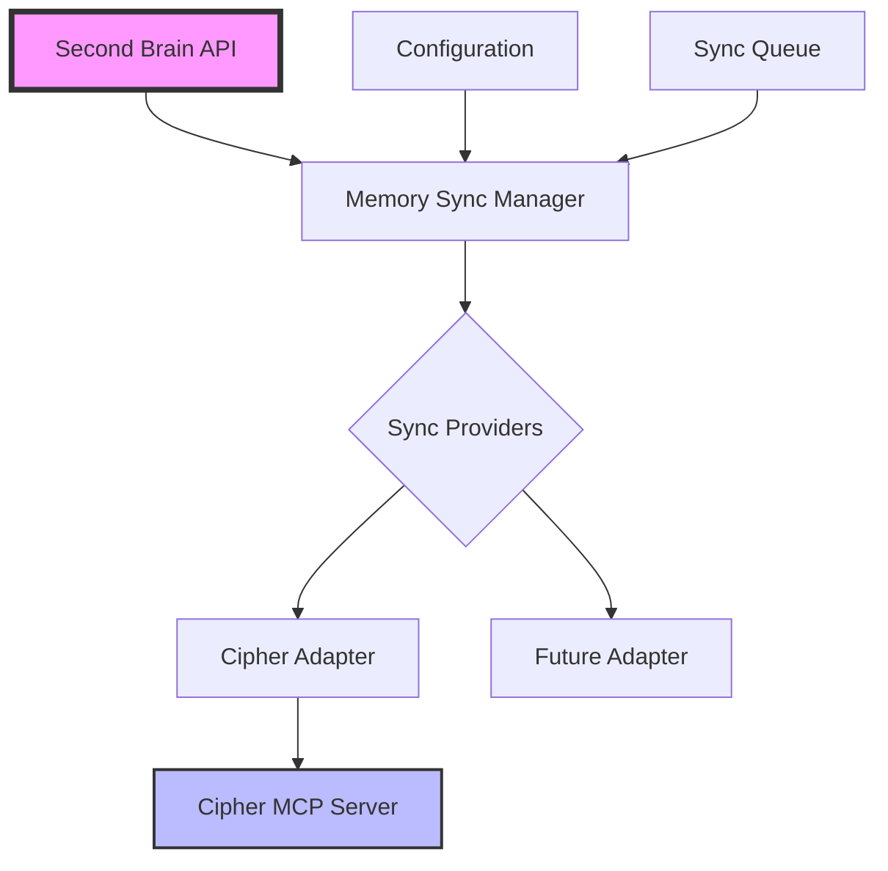

# ADR-002: Cipher Integration via Adapter Pattern

## Status
Accepted

## Context
Second Brain is a standalone knowledge management system with its own PostgreSQL + pgvector backend. Cipher is an AI memory layer specifically designed for coding agents with excellent IDE integration via MCP (Model Context Protocol).

Our CEO has directed that we should treat Cipher as an optional integration for developer teams, not a core dependency. This allows us to leverage Cipher's IDE integration strengths without compromising our architecture.

## Decision
We will implement a clean adapter pattern that allows users to optionally enable Cipher integration based on their needs:

1. **Solo developers**: Use Second Brain standalone (default)
2. **AI-IDE users**: Enable Second Brain + Cipher sync for IDE memory persistence
3. **Teams**: Use Second Brain for long-term persistence + Cipher for real-time IDE sharing

## Architecture

### Core Principles
- **Zero dependency by default**: Cipher is not required to run Second Brain
- **Plugin architecture**: Cipher integration is a plugin that can be enabled/disabled
- **Bi-directional sync**: Changes in either system propagate to the other
- **Conflict resolution**: Second Brain is the source of truth for conflicts
- **Graceful degradation**: System works perfectly without Cipher

### Component Design



### Key Interfaces

```typescript
// Abstract interface for any memory sync provider
interface IMemorySyncProvider {
  name: string;
  isEnabled(): boolean;
  connect(): Promise<void>;
  disconnect(): Promise<void>;
  
  // Sync operations
  syncMemory(memory: Memory): Promise<void>;
  syncBatch(memories: Memory[]): Promise<void>;
  pullChanges(since: Date): Promise<Memory[]>;
  
  // Health monitoring
  healthCheck(): Promise<HealthStatus>;
}

// Configuration for sync providers
interface SyncProviderConfig {
  enabled: boolean;
  syncInterval?: number;
  conflictResolution?: 'local' | 'remote' | 'newest';
  filters?: SyncFilter[];
}
```

## Implementation Plan

### Phase 1: Foundation (Week 1)
- Create abstract interfaces and base classes
- Implement plugin registration system
- Add configuration management

### Phase 2: Cipher Adapter (Week 2)
- Implement CipherAdapter class
- Add MCP protocol support
- Create sync queue system

### Phase 3: Sync Service (Week 3)
- Build bi-directional sync engine
- Implement conflict resolution
- Add monitoring and logging

### Phase 4: Documentation & Testing (Week 4)
- Complete integration documentation
- Create example configurations
- Build integration tests

## Consequences

### Positive
- **Flexibility**: Users choose their integration level
- **No vendor lock-in**: Can swap Cipher for other providers
- **Clean architecture**: Core system remains independent
- **Team enablement**: Supports various team workflows

### Negative
- **Additional complexity**: Sync logic adds complexity
- **Potential conflicts**: Must handle sync conflicts gracefully
- **Maintenance burden**: Another integration to maintain

### Neutral
- **Configuration required**: Users must configure if they want Cipher
- **Learning curve**: Teams need to understand sync behavior

## Security Considerations
- API keys stored securely in environment variables
- Sync traffic encrypted via HTTPS/WSS
- Option to exclude sensitive memories from sync
- Audit logging for all sync operations

## Success Metrics
- Zero impact on standalone performance
- < 5 second sync latency
- 99.9% sync reliability
- Easy setup (< 5 minutes)